# Lab 0: RV64 内核调试

## 1 实验目的


按照实验流程搭建实验环境，掌握基本的 Linux 概念与用法，熟悉如何从 Linux 源代码开始将内核运行在 QEMU 模拟器上，学习使用 GDB 跟 QEMU 对代码进行调试，为后续实验打下基础。


## 2 实验内容及要求


- 学习 Linux 基本知识
- 安装 Docker，下载并导入 Docker 镜像，熟悉 docker 相关指令
- 编译内核并用 GDB + QEMU 调试，在内核初始化过程中设置断点，对内核的启动过程进行跟踪，并尝试使用 GDB 的各项命令


请各位同学独立完成实验，任何抄袭行为都将使本次实验判为0分。

**请跟随实验步骤完成实验并根据本文档中的要求记录实验过程，最后删除文档末尾的附录部分**，将文档导出并命名为**“学号_姓名_lab0.pdf”**，以 pdf 格式上传至学在浙大平台。


## 3 操作方法和实验步骤


### 3.1 安装 Docker 环境并创建容器 (25%)


请参考[【附录B.Docker使用基础】](#4389418c)了解相关背景知识。


#### 3.1.1 安装 Docker 并启动


请参照 [https://docs.docker.com/get-docker/](https://docs.docker.com/get-docker/) 自行在本机安装 Docker 环境，安装完成后启动 Docker 软件。


> docker 卡在 start 界面的 Windows 用户，可看 [https://github.com/docker/for-win/issues/13662](https://github.com/docker/for-win/issues/13662) 来解决。By 杨煜卓同学


> mac用户需要在docker desktop设置中取消选项（默认勾选）
> Use Rosetta for x86_64/amd64 emulation on Apple Silicon

#### 3.1.2 下载并导入 Docker 镜像


为了便于开展实验，我们在 [镜像](https://pan.zju.edu.cn/share/5f6f92707a5ea28b4e51c93875) 中提前安装好了实验所需的环境（RISC-V 工具链、QEMU 模拟器），相关环境变量也以设置完毕。**请下载该 Docker 镜像至本地。**

> 下载好的镜像包不需要解压，后面命令中直接使用。


接下来建议大家使用终端操作，而非使用桌面端等 UI 程序，这样每一步操作有迹可循，易于排查问题。


- Windows 用户：可以使用系统自带的 PowerShell 软件，命令提示符 (cmd) 软件不推荐使用。
- MacOS 用户：使用默认终端即可。
- Linux 用户：使用默认终端即可。


**在执行每一条命令前，请你对将要进行的操作进行思考，给出的命令不需要全部执行，并且不是所有的命令都可以无条件执行，请不要直接复制粘贴命令去执行。**
以下给出的指令中， `$` 提示符表示当前运行的用户为普通用户，`#` 代表 Shell 中注释的标志，他们并非实际输入指令的一部分。


> 导入失败的同学请查看自己的 C 盘空间是否满。


```bash
# 进入 oslab.tar 所在的文件夹
$ cd path/to/oslab # 替换为你下载文件的实际路径

# 导入docker镜像
$ docker import oslab.tar oslab:2024

# 查看docker镜像
$ docker image ls
REPOSITORY   TAG       IMAGE ID       CREATED          SIZE
oslab        2024      9192b7dc0d06   47 seconds ago   2.89GB
```


**请在此处添加你导入容器的执行命令及结果截图：**
答：REPOSITORY   TAG       IMAGE ID       CREATED          SIZE
oslab        2024      cb1563d9fa64   32 seconds ago   2.89GB
oslab        2023      82d0574defb2   6 days ago       2.89GB
alpine       3.16.3    bfe296a52501   22 months ago    5.54MB

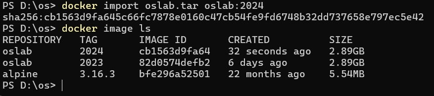
___________________________________________


#### 3.1.3 从镜像创建一个容器并进入该容器


请按照以下方法创建新的容器，并建立 volume 映射([参考资料](https://kebingzao.com/2019/02/25/docker-volume/))。建立映射后，你可以方便的在本地编写代码，并在容器内进行编译检查。


> 什么是 volumn 映射？其实就是把本地的一个文件夹共享给 Docker 容器用，无论你在容器内修改还是在本地环境下修改，另一边都能感受到这个文件夹变化了。


你也可以参照[文档](https://yuque.zju.edu.cn/ytqfu3/mgf5fz/iaxaa2)中提供的，通过配置 VSCode 智能提示来直接连接到 Docker 容器内进行进行实验，**如若此，请提供你使用软件直接在 Docker 容器内进行编辑的截图即可。下文的建立映射关系可以跳过。**


> 如果你使用 VSCode 或其他具有直接连接 Docker 容器功能的软件，你也可以直接在 Docker 容器内进行编辑，而无需建立映射关系，如若此，请提供你使用软件直接在 Docker 容器内进行编辑的截图即可。


> Windows 中的路径一般分 C，D，E 等多盘符，因此 Windows 下的路径一般为 xx盘符:\xx路径，例如 C:\Users\Administor，而 Linux 下与 Windows 不同，Linux 只有一个根目录 /，例如 /home/oslab/lab1 表示 根目录下的 home 文件夹下的 oslab 文件夹 下的 lab1 文件夹，在映射路径时请按照自己系统的路径描述方法填写。更多细节可自行搜索学习。


> Linux 下一般默认 /home 文件夹用来存放用户文件，而别的路径用来存放系统文件，因此请在映射文件夹的时候映射到 /home 的文件夹目录下。/home/aaa 表示 aaa 用户的用户文件所在目录，同理 /home/oslab 表示 oslab 用户的用户文件所在目录。如果你使用的是虚拟机，请映射到 /home/自己用户名 的目录下，一般情况下 ~ 符号等价于 /home/当前用户名，详情请自行搜索 Linux 下 /home 目录含义。


> 一般来说，aaa 用户不能访问 bbb 用户的用户文件，也就是不能访问/修改 /home/bbb 文件夹。但Docker 容器中用的是 root 用户登录，相当于 Windows 中的管理员权限，因此可以访问 /home/oslab 下的文件。


指令仅做参考，注意修改指令中的路径为你自己设置的路径。**如果你使用的是 Windows 系统，建议****不要****将本地新建的目录放在 C 盘等位置。避免后续指令权限问题。本地目录和映射的目录路径不需要相同。**


```shell
# 首先请在本地新建一个目录用作映射需要
$ cd /path/to/your/local/dir
$ mkdir os_experiment

# 创建新的容器，同时建立 volume 映射
$ docker run -it -v /path/to/your/local/dir/os_experiment:/home/oslab/os_experiment oslab:2024 /bin/bash
oslab@3c1da3906541:~$
```


**请在此处添加一张你执行 Docker 映射的命令及结果截图：**
答：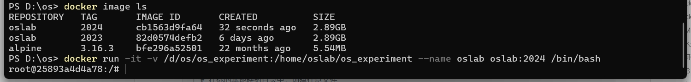
___________________________________________

**请解释该命令各参数含义：**

- `docker run -it -v /path/to/your/local/dir/os_experiment:/home/oslab/os_experiment oslab:2024 /bin/bash`

答：docker run是运行一个容器
    -i是启动交互模式
    -t是分配一个终端
    -v是创建volume映射
    后面是主机上的目录挂载到容器中的指定路径
    --name oslab是给容器起一个名字
    oslab:2024是指定要运行的镜像
    /bin/bash是指定容器的启动命令
    （你可以借助 `docker run --help` 获得提示）


#### 3.1.4 测试映射关系


为测试映射关系是否成功，你可以在本地映射目录中创建任意文件，并在 Docker 容器中进行检查。


```shell
# 在你的本地映射目录中，创建任意文件
$ cd /path/to/your/local/dir/os_experiment
$ touch testfile
$ ls
testfile
```


以上指令将在你的本地映射目录创建一个文件，接下来在容器中执行指令进行检查。


```shell
# 在 Docker 容器中确认是否挂载成功
root@dac72a2cc625:/home/oslab/os_experiment$ ls
testfile
# 退出docker，退出后容器将变为关闭状态，再次进入时需要重新启动容器（不是重新创建容器）
root@dac72a2cc625:/home/oslab/os_experiment$ exit
```


可以看到创建的文件存在，证明映射关系建立成功，接下来你可以使用你喜欢的 IDE 在该目录下进行后续实验的编码了。


**请在此处添加你测试映射关系的全指令截图：**
答：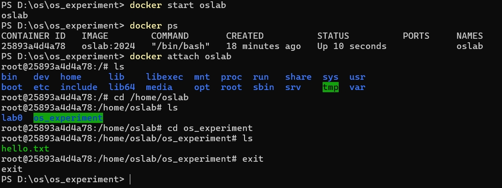
___________________________________________

其他常用docker指令如下，在后续的实验过程中将会经常使用这些命令：


```shell
# 查看当前运行的容器
$ docker ps
CONTAINER ID   IMAGE     COMMAND   CREATED   STATUS    PORTS     NAMES

# 查看所有存在的容器
$ docker ps -a
CONTAINER ID   IMAGE        COMMAND       CREATED              STATUS                          PORTS     NAMES
95efacf34d2c   oslab:2024   "/bin/bash"   About a minute ago   Exited (0) About a minute ago             oslab

# 启动处于停止状态的容器
$ docker start oslab
$ docker ps
CONTAINER ID   IMAGE        COMMAND       CREATED         STATUS          PORTS     NAMES
95efacf34d2c   oslab:2024   "/bin/bash"   2 minutes ago   Up 26 seconds             oslab

# 进入已经运行的容器
$ docker attach oslab
root@95efacf34d2c:/#

# 在已经运行的docker中运行/bin/bash命令，开启一个新的进程
$ docker exec -it oslab /bin/bash
root@95efacf34d2c:/#
```


### 3.2 编译 Linux 内核 (25%)


请参考[【附录E.LINUX 内核编译基础】](#1ee65285)了解相关背景知识。


```bash
# 以下指令均在容器中操作

# 进入实验目录
$ cd /home/oslab/lab0

# 查看当前目录文件
$ ls
linux  rootfs.ext4

# 创建目录，用来存储编译结果
$ mkdir -p build/linux

# 编译 Linux 内核
$ make -C linux \
       O=/home/oslab/lab0/build/linux \
       CROSS_COMPILE=riscv64-unknown-linux-gnu- \
       ARCH=riscv \
       CONFIG_DEBUG_INFO=y \
       defconfig \
       all \
       -j$(nproc)
```


有关 make 指令和 makefile 的知识将在 Lab1 进一步学习。这里简单介绍一下编译 Linux 内核各参数的含义。


| `-C linux` | 表示进入 linux 文件夹，并执行该目录下的 makefile 文件。因此，你执行该命令时应在 `/home/oslab/lab0` 路径下。 |
| --- | --- |
| `O=.....` | 指定变量 O 的值，O 变量在 linux makefile 里用来表示编译结果输出的路径 |
| `CROSS_COMPILE=.....` | 指定变量 CROSS_COMPILE 的值，linux makefile 中使用CROSS_COMPILE 变量的值作为前缀选择编译时使用的工具链。例如本例子中， `riscv64-unknown-linux-gnu-gcc`即是实际编译时调用的编译器。 |
| `ARCH=.....` | 指定编译的目标平台 |
| `CONFIG_DEBUG_INFO=y` | 同上，当该变量设置时，编译过程中将加入 `-g` 配置，这会使得编译结果是包含调试信息的，只有这样我们才可以比较好的进行调试。 |
| `defconfig` | 指定本次编译的目标，支持什么编译目标是 linux makefile 中已经定义好的，defconfig 就表示本次编译要编译出 defconfig 这个目标，该目标代表编译需要的一些配置文件。 |
| `all` | 指定本次编译的目标，目标是可以有多个的。这里的 all 并不表示编译所有目标，而是 makefile 中定义好的一个名称为 all 的编译目标。该目标代表 linux 内核。 |
| `-j$(nproc)`  | `-j` 表示采用多线程编译，后跟数字表示采用线程数量。例如 `-j4` 表示 4 线程编译。这里的 `${nproc}` 是 shell 的一种语法，表示执行 `nproc` 命令，并将执行的结果替换这段字符串。 `nproc` 命令会返回本机器的核心数量。 |

> 编译报错为 Error.137 的同学，可能是电脑性能不足，可以将最后的参数改为 -j1，降低资源消耗。改为 -j1 后仍然报错。可尝试创建swap虚拟内存。


> 在docker的设置中可以调整给docker分配的资源数量，可以根据需要适当调整。
> 
> 如果还不行的话，可以给电脑分配更多的虚拟内存解决，Linux 上可以创建 swap 分区，Windows 上可以在我的电脑，高级设置中修改虚拟内存大小。


**请在此处添加一张你的编译完成的结果截图：**
答：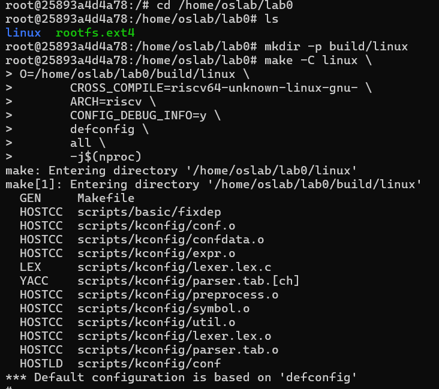
    ...省略中间编译一堆的过程...
    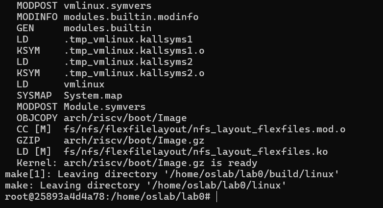
___________________________________________


### 3.3 使用 QEMU 运行内核 (25%)


请参考[【附录C.QEMU使用基础】](#bd00d2f4)了解相关背景知识。


**注意，QEMU的退出方式较为特殊，需要先按住 `ctrl+a`，放开后再按一次 `x`。**


```bash
$ cd /home/oslab/lab0

# 如果不在上面目录下执行的话，请手动修改 -kernel 和 file=.... 的文件路径，这里使用的是相对路径
$ qemu-system-riscv64 \
		-nographic \
    -machine virt \
    -kernel build/linux/arch/riscv/boot/Image  \
 		-device virtio-blk-device,drive=hd0 \
    -append "root=/dev/vda ro console=ttyS0"   \
 		-bios default -drive file=rootfs.ext4,format=raw,id=hd0 \
 		-netdev user,id=net0 -device virtio-net-device,netdev=net0
 
# 执行成功会提示登录，默认用户名为 root，密码为空，这里输入 root 进入即可
# Welcome to Buildroot
# buildroot login:
```


登录成功后，你可以在这个模拟运行的内核系统里到处看看。使用 `uname -a` 指令来确定你运行的系统是 riscv64 架构。


**请在此处添加一张你成功登录后的截图：**
答：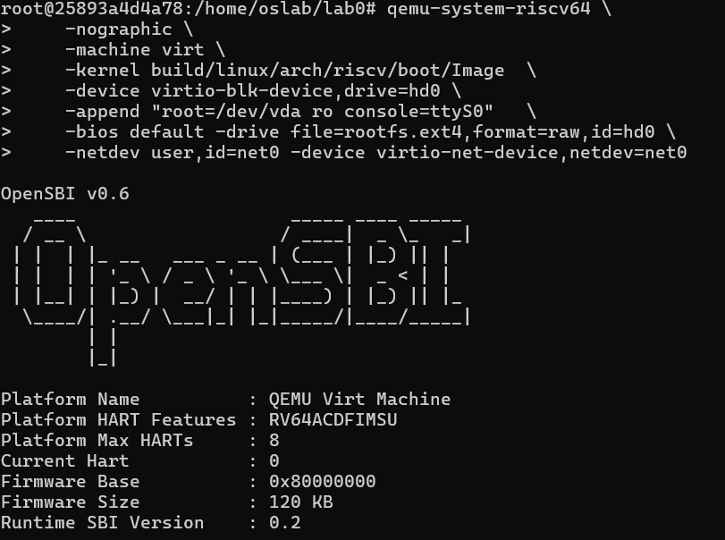
___中间省略...
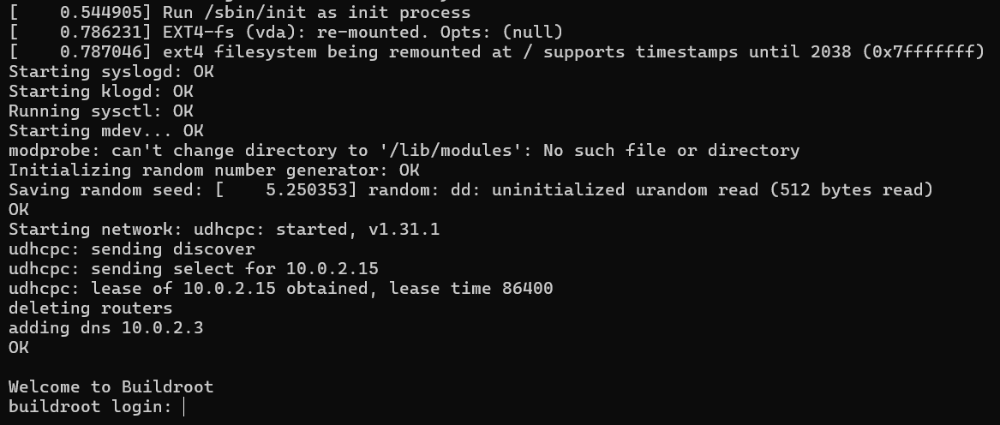___________________________________________


**请在此处添加一张你运行 ** `**uname -a**` ** 指令后的结果截图：**
答：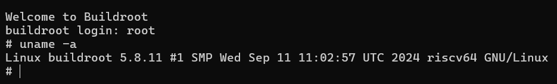___________________________________________

### 3.4 使用 GDB 调试内核 (25%)


请参考[【附录D.GDB使用基础】]()了解相关背景知识。学会调试将在后续实验中为你提供帮助，推荐同学们跟随[GDB调试入门指南](https://zhuanlan.zhihu.com/p/74897601) 教程完成相应基础练习，熟悉 GDB 调试的使用。


首先请你退出上一步使用 QEMU 运行的内核，并重新使用 QEMU 按照下述参数模拟运行内核（**不是指在上一步运行好的 QEMU 运行的内核中再次运行下述命令！**）。


```shell
$ qemu-system-riscv64 \
		-nographic \
    -machine virt \
    -kernel build/linux/arch/riscv/boot/Image  \
 		-device virtio-blk-device,drive=hd0 \
    -append "root=/dev/vda ro console=ttyS0"   \
 		-bios default -drive file=rootfs.ext4,format=raw,id=hd0 \
 		-netdev user,id=net0 -device virtio-net-device,netdev=net0 \
    -S \
    -s
 
 # -S: 表示启动时暂停执行，这样我们可以在 GDB 连接后再开始执行
 # -s: -gdb tcp::1234 的缩写，会开启一个 tcp 服务，端口为 1234，可以使用 GDB 连接并进行调试
```


上述命令由于 `-S` 的原因，执行后会直接停止，表现为没有任何反应。**接下来再打开一个终端，进入同一个 Docker 容器**，并切换到 `lab0` 目录，使用 GDB 进行调试。


```shell
# 进入同一个 Docker 容器
$ docker exec -it oslab /bin/bash

# 切换到 lab0 目录
$ cd /home/oslab/lab0/

# 使用 GDB 进行调试
$ riscv64-unknown-linux-gnu-gdb build/linux/vmlinux
```


**顺序执行下列 GDB 命令，写出每条命令的含义并附上执行结果的截图。(可以全部执行后一起截图，不需要每个命令截一次图)**


```shell
(gdb) target remote localhost:1234
```


- 含义：target remote 命令表示远程调试，而 1234 是上述 QEMU 执行时指定的用于调试连接的端口号。
- 执行结果：


```shell
(gdb) b start_kernel 
(gdb) b *0x80000000
(gdb) b *0x80200000
(gdb) info breakpoints
(gdb) delete 2
(gdb) info breakpoints
```


- 含义：先建立两个断点，一个在 `start_kernel` 函数处，一个在 `0x80000000` 处。然后查看当前断点信息，删除第二个断点，再查看断点信息。
- 执行结果：
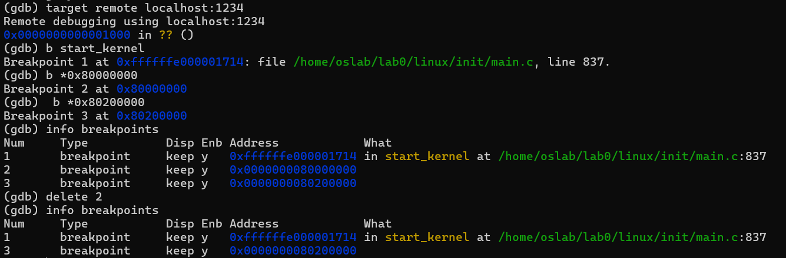


```shell
(gdb) continue
(gdb) delete 3
(gdb) continue
(gdb) step
(gdb) s
(gdb) (不做输入，直接回车)
(gdb) next
(gdb) n
(gdb) (不做输入，直接回车)
```


- 含义：先继续运行程序，然后删除第三个断点，再继续运行程序，单步执行，单步执行，单步执行。
- 执行结果：
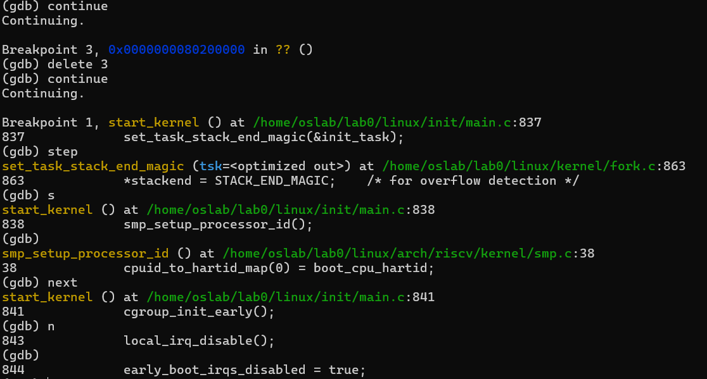


```shell
(gdb) disassemble
(gdb) nexti
(gdb) n
(gdb) stepi
(gdb) s
```


- 含义：先查看当前程序的反汇编，然后单步执行，单步执行，单步执行。
- 执行结果：
- 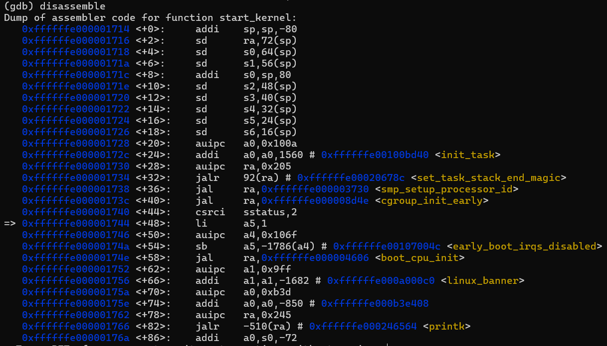
- 
- **请回答：nexti 和 next 的区别在哪里？stepi 和 step 的区别在哪里？next 和 step 的区别是什么？**
答：nexti 逐条执行机器指令，next 逐行执行源代码，stepi 单步执行机器指令，step 单步执行源代码。next 和 step 的区别在于 next 会跳过函数调用，而 step 不会。
___________________________________________


```shell
(gdb) continue
# 这个地方会卡住，可以用 ctrl+c 强行中断
(gdb) quit
```


- 含义：先继续运行程序，然后退出 GDB。
- 执行结果：
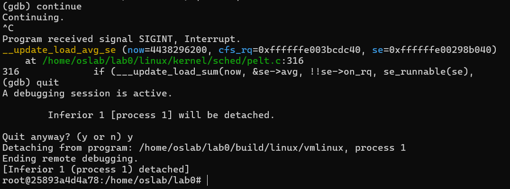


**`vmlinux`**** 和 ****`Image`**** 的关系和区别是什么？为什么 QEMU 运行时使用的是 **`**Image**`** 而不是**`**vmlinux**`**？**
**提示：一个可执行文件包括哪几部分？从vmlinux到Image发生了什么？**
答：vmlinux 是直接编译出来的原生未压缩的，可直接用于调试的内核镜像文件；Image是未压缩的，但是是经过objcopy转换过的，去掉了一些符号表等信息；
QEMU 使用 Image 而非 vmlinux 是因为 Image 文件已经经过打包和格式处理，可以直接在模拟的硬件上引导，而 vmlinux 更适合用于调试时加载符号信息。___________________________________________


## 4 讨论和心得


请在此处填写实验过程中遇到的问题及相应的解决方式。


实验可能存在不足之处，欢迎同学们对本实验提出建议。


os和硬件以及编译有着密不可分的联系，是理解计算机系统（软硬件）运行的关键一环，在进行实验和学习的过程中希望大家能够多去联系硬件与编译课程上的知识，理解彼此之间的分工与配合。

心得：在实验过程中，我们学习到了如何使用 Docker 容器、QEMU 模拟器、GDB 调试器，以及 Linux 内核的编译。通过这几个工具的使用，我们可以更加深入地理解计算机系统的运行原理。同时，我们也了解到如何使用命令行来操作系统，并学会了如何使用 GDB 调试器来调试内核。我一开始docker一直没反应，输入指令之后没有任何输出，后来重新下载了docker才正常工作。后续的实验内容主要是在熟悉docker和gdb的各种指令，以及linux的编译过程。总的来讲内容不多，适合我这种没碰过linux的小白。


## 附录


### A. Linux 使用基础


#### Linux简介


Linux 是一套免费使用和自由传播的类 Unix 操作系统，是一个基于 POSIX 和 UNIX 的多用户、多任务、支持多线程和多 CPU 的操作系统。


在 Linux 环境下，人们通常使用命令行接口来完成与计算机的交互。终端（Terminal）是用于处理该过程的一个应用程序，通过终端你可以运行各种程序以及在自己的计算机上处理文件。在类 Unix 的操作系统上，终端可以为你完成一切你所需要的操作。我们仅对实验中涉及的一些概念进行介绍，你可以通过下面的链接来对命令行的使用进行学习：


1. [The Missing Semester of Your CS Education](https://missing-semester-cn.github.io/2020/shell-tools)[>>Video<<](https://www.bilibili.com/video/BV1x7411H7wa?p=2)
1. [GNU/Linux Command-Line Tools Summary](https://tldp.org/LDP/GNU-Linux-Tools-Summary/html/index.html)
1. [Basics of UNIX](https://github.com/berkeley-scf/tutorial-unix-basics)
1. [TLCL (billie66.github.io)](http://billie66.github.io/TLCL/book/index.html)（Shell 命令基础介绍）
1. [实验楼 Linux 学习课程](https://www.lanqiao.cn/courses/1) 免费的 Linux 模拟环境，仅供练习。


#### Linux中的环境变量


环境变量一般是指在操作系统中用来指定操作系统运行环境的一些参数。常见的例如 PATH 变量，它用来指明系统中可执行文件的默认搜索路径。我们可以通过 `which` 命令来做一些小的实验：


```bash
$ which gcc
/usr/bin/gcc

$ ls -l /usr/bin/gcc
lrwxrwxrwx 1 root root 5 May 20  2019 /usr/bin/gcc -> gcc-7
```


`which` 命令将会输出一个可执行程序的实际路径。可以看到，当我们在输入 `gcc` 命令时，终端实际执行的程序是 `/usr/bin/gcc`。实际上，终端在执行命令时，会从 `PATH` 环境变量所包含的地址中查找对应的程序来执行。我们可以将 `PATH` 变量打印出来来检查一下其是否包含 `/usr/bin`。


```bash
$ echo $PATH
/usr/local/sbin:/usr/local/bin:/usr/sbin:/usr/bin:/sbin:/bin:/usr/games:/usr/local/games:/snap/bin:/home/phantom/.local/bin
```


因此，如果你想直接使用 `riscv64-unknown-linux-gnu-gcc`、`qemu-system-riscv64` 等程序，你只需要把他们所在的目录添加到 `PATH` 环境变量中即可，镜像中已帮助你完成了这步操作，可在相应容器中使用`echo $PATH` 命令检查是否包含 `/opt/riscv/bin` 目录。


```bash
$ export PATH=$PATH:/opt/riscv/bin
```


进一步的，你可以检查该目录下是否含有 riscv64 等相关编译文件。


### B. Docker 使用基础


#### Docker 基本介绍


在生产开发环境中，常常会遇到应用程序和系统环境变量以及一些依赖的库文件不匹配，导致应用无法正常运行的问题，因此出现了 Docker。Docker 是一种利用容器（container）来进行创建、部署和运行应用的工具。Docker 把一个应用程序运行需要的二进制文件、运行需要的库以及其他依赖文件打包为一个包（package），然后通过该包创建容器并运行，由此被打包的应用便成功运行在了 Docker 容器中。


比如，你在本地用 Python 开发网站后台，开发测试完成后，就可以将 Python3 及其依赖包、Flask 及其各种插件、Mysql、Nginx 等打包到一个容器中，然后部署到任意你想部署到的环境。


Docker中有三个重要概念：


1. 镜像（Image）：类似于虚拟机中的镜像，是一个包含有文件系统的面向 Docker 引擎的只读模板。任何应用程序运行都需要环境，而镜像就是用来提供这种运行环境的。
2. 容器（Container）：Docker 引擎利用容器来运行、隔离各个应用。**容器是镜像创建的应用实例**，可以创建、启动、停止、删除容器，各个容器之间是是相互隔离的，互不影响。镜像本身是只读的，容器从镜像启动时，Docker 在镜像的上层创建一个可写层，镜像本身不变。
3. 仓库（Repository）：镜像仓库是 Docker 用来集中存放镜像文件的地方，一般每个仓库存放一类镜像，每个镜像利用 tag 进行区分，比如 Ubuntu 仓库存放有多个版本（12.04、14.04等）的 Ubuntu 镜像。


#### Docker基本命令


实验中只需要了解 Docker 中容器操作的相关命令及选项即可，可以通过 [Docker 命令大全 | 菜鸟教程 (runoob.com)](https://www.runoob.com/docker/docker-command-manual.html) 进行初步了解。


```shell
# 列出所有镜像
$ docker image ls

# 从镜像 oslab:2024 中创建容器，使用交互式终端，并在容器内执行 /bin/bash 命令
$ docker run -it oslab:2024 /bin/bash

# 启动容器时，使用-v参数指定挂载宿主机目录，启动一个centos容器将宿主机的/test目录挂载到容器的/soft目录
$ docker run -it -v /test:/soft centos /bin/bash

# 进入已经运行的容器
$ docker attach oslab

# 在已经运行的docker中运行/bin/bash命令，开启一个新的进程
$ docker exec -it oslab /bin/bash

# 停止容器
$ docker stop ID

# 启动处于停止状态的容器
$ docker start ID

# 重命名容器
$ docker rename oldname newname

# 列出所有的容器
$ docker ps -a

# 删除容器
$ docker rm ID
```


### C. QEMU 使用基础


#### 什么是QEMU


QEMU 最开始是由法国程序员 Fabrice Bellard 等人开发的可执行硬件虚拟化的开源托管虚拟机。


QEMU 主要有两种运行模式。**用户模式下，QEMU 能够将一个平台上编译的二进制文件在另一个不同的平台上运行。**如一个 ARM 指令集的二进制程序，通过 QEMU 的 TCG（Tiny Code Generator）引擎的处理之后，ARM 指令被转化为 TCG 中间代码，然后再转化为目标平台（如Intel x86）的代码。


**系统模式下，QEMU 能够模拟一个完整的计算机系统，该虚拟机有自己的虚拟 CPU、芯片组、虚拟内存以及各种虚拟外部设备。**它使得为跨平台编写的程序进行测试及除错工作变得容易。


#### 如何使用 QEMU（常见参数介绍）


以该命令为例，我们简单介绍 QEMU 的参数所代表的含义


```bash
$ qemu-system-riscv64 \
		-nographic \
    -machine virt \
    -kernel build/linux/arch/riscv/boot/Image  \
    -append "root=/dev/vda ro console=ttyS0"   \
 		-device virtio-blk-device,drive=hd0 \
 		-bios default -drive file=rootfs.ext4,format=raw,id=hd0 \
 		-netdev user,id=net0 -device virtio-net-device,netdev=net0 
    -S \
    -s \
```


- **-nographic：**不使用图形窗口，使用命令行
- **-machine：**指定要 emulate 的机器，可以通过命令 `qemu-system-riscv64 -machine help`查看可选择的机器选项
- **-kernel：**指定内核image
- **-append cmdline：**使用 cmdline 作为内核的命令行
- **-device：**指定要模拟的设备，可以通过命令 `qemu-system-riscv64 -device help`查看可选择的设备，通过命令 `qemu-system-riscv64 -device <具体的设备>,help`查看某个设备的命令选项
- **-drive, file=<file_name>：**使用 file 作为文件系统
- **-netdev user,id=str：**指定 user mode 的虚拟网卡, 指定 ID 为 str
- **-S：**启动时暂停 CPU 执行(使用 c 启动执行)
- **-s：**-gdb tcp::1234 的简写
- **-bios default：**使用默认的 OpenSBI firmware 作为 bootloader


更多参数信息可以参考官方文档 [System Emulation — QEMU documentation (qemu-project.gitlab.io)](https://qemu-project.gitlab.io/qemu/system/index.html)


### D. GDB 使用基础


#### 什么是 GDB


GNU调试器（英语：GNU Debugger，缩写：gdb）是一个由 GNU 开源组织发布的、UNIX/LINUX 操作系统下的、基于命令行的、功能强大的程序调试工具。借助调试器，我们能够查看另一个程序在执行时实际在做什么（比如访问哪些内存、寄存器），在其他程序崩溃的时候可以比较快速地了解导致程序崩溃的原因。被调试的程序可以是和 gdb 在同一台机器上，也可以是不同机器上。


总的来说，gdb 可以有以下4个功能：


- 启动程序，并指定可能影响其行为的所有内容
- 使程序在指定条件下停止
- 检查程序停止时发生了什么
- 更改程序中的内容，以便纠正一个 bug 的影响


#### GDB 基本命令介绍


在 gdb 命令提示符“(gdb)”下输入“help”可以查看所有内部命令及使用说明。


- (gdb) start：单步执行，运行程序，停在第一执行语句
- (gdb) next：单步调试（逐过程，函数直接执行）,简写n
- (gdb) run：重新开始运行文件（run-text：加载文本文件，run-bin：加载二进制文件），简写r
- (gdb) backtrace：查看函数的调用的栈帧和层级关系，简写bt
- (gdb) break 设置断点。比如断在具体的函数就break func；断在某一行break filename:num
- (gdb) finish：结束当前函数，返回到函数调用点
- (gdb) frame：切换函数的栈帧，简写f
- (gdb) print：打印值及地址，简写p
- (gdb) info：查看函数内部局部变量的数值，简写i；查看寄存器的值i register xxx
- (gdb) display：追踪查看具体变量值
- (gdb) layout src：显示源代码窗口
- (gdb) layout asm：显示汇编窗口
- (gdb) layout regs：显示源代码/汇编和寄存器窗口
- Ctrl + x，再按 a：退出layout


**学会调试将在后续实验中为你提供帮助，推荐同学们跟随 [GDB调试入门指南](https://zhuanlan.zhihu.com/p/74897601) 教程完成相应基础练习，熟悉 gdb 调试的使用。**


### E. LINUX 内核编译基础


#### 交叉编译


交叉编译指的是在一个平台上编译可以在另一个平台运行的程序，例如在 x86 机器上编译可以在 arm 平台运行的程序，交叉编译需要交叉编译工具链的支持。


#### 内核配置


内核配置是用于配置是否启用内核的各项特性，内核会提供一个名为 `defconfig` (即 Default Configuration)的默认配置，该配置文件位于各个架构目录的 `configs` 文件夹下，例如对于 RISC-V 而言，其默认配置文件为 `arch/riscv/configs/defconfig`。使用 `make ARCH=riscv defconfig` 命令可以在内核根目录下生成一个名为`.config` 的文件，包含了内核完整的配置，内核在编译时会根据 `.config` 进行编译。配置之间存在相互的依赖关系，直接修改 defconfig 文件或者 `.config` 有时候并不能达到想要的效果。因此如果需要修改配置一般采用 `make ARCH=riscv menuconfig` 的方式对内核进行配置。


#### 常见参数


**ARCH** 指定架构，可选的值包括 arch 目录下的文件夹名，如 x86，arm，arm64 等，不同于 arm 和 arm64，32 位和 64 位的 RISC-V 共用 `arch/riscv` 目录，通过使用不同的 config 可以编译 32 位或 64 位的内核。


**CROSS_COMPILE** 指定使用的交叉编译工具链，例如指定 `CROSS_COMPILE=aarch64-linux-gnu-`，则编译时会采用 `aarch64-linux-gnu-gcc` 作为编译器，编译可以在 arm64 平台上运行的 kernel。


**CC** 指定编译器，通常指定该变量是为了使用 clang 编译而不是用 gcc 编译，Linux内核在逐步提供对 clang 编译的支持，arm64 和 x86 已经能够很好的使用 clang 进行编译。


#### 常用编译选项


```shell
$ make defconfig	        # 使用当前平台的默认配置，在 x86 机器上会使用 x86 的默认配置
$ make -j$(nproc)	        # 编译当前平台的内核，-j$(nproc)为以机器硬件线程数进行多线程编译

$ make ARCH=riscv defconfig	# 使用RISC-V平台的默认配置
$ make ARCH=riscv CROSS_COMPILE=riscv64-linux-gnu- -j$(nproc)     # 编译RISC-V平台内核

$ make clean	              # 清除所有编译好的object文件
$ make mrproper	            # 清除编译的配置文件，中间文件和结果文件

$ make init/main.o	        # 编译当前平台的单个object文件init/main.o（会同时编译依赖的文件）
```
