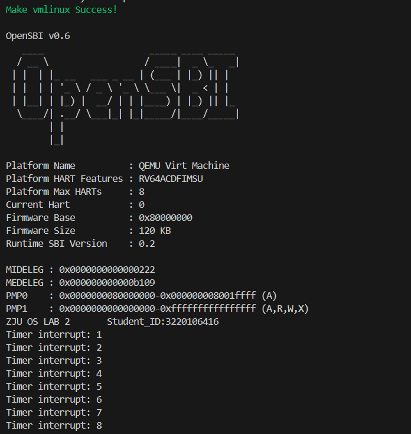
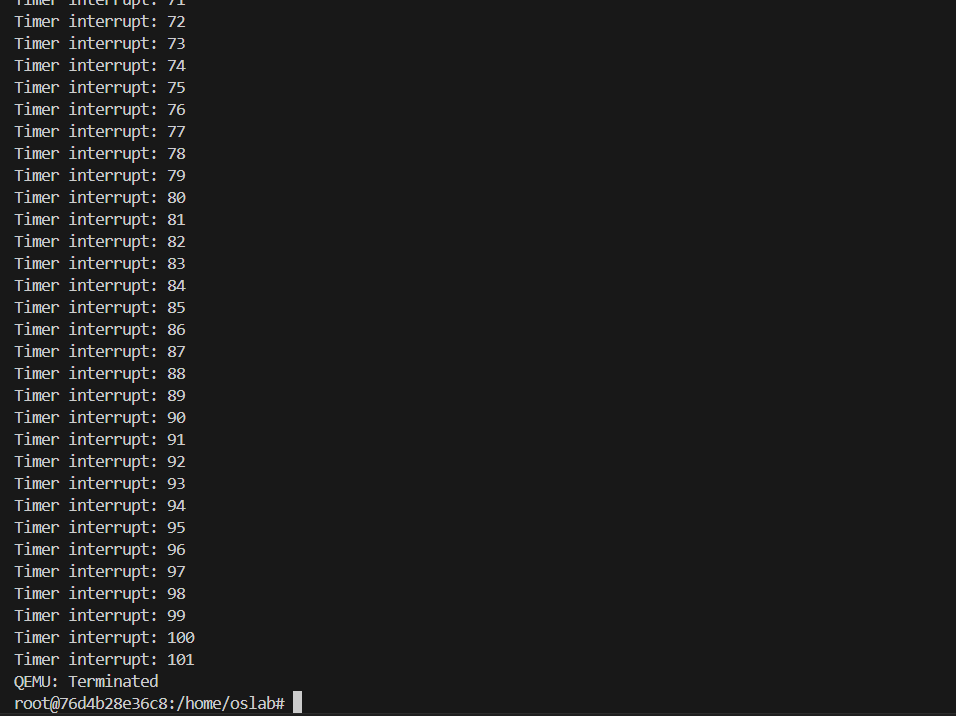

# Lab 1: RV64 内核引导与时钟中断

## 1 实验目的


学习 RISC-V 相关知识，了解 OpenSBI 平台，实现 sbi 调用函数，封装打印函数，并利用 Makefile 来完成对整个工程的管理。


## 2 实验内容及要求


- 阅读 RISC-V 中文手册，学习 RISC-V 相关知识
- 学习 Makefile 编写规则，补充 Makefile 文件使得项目成功运行
- 了解 OpenSBI 的运行原理，编写代码通过 sbi 调用实现字符串的打印
- 利用 OpenSBI 平台的 SBI 调用触发时钟中断，并通过代码设计实现定时触发时钟中断的效果


请各位同学独立完成实验，任何抄袭行为都将使本次实验判为0分。


**请跟随实验步骤完成实验并根据文档中的要求记录实验过程，最后删除文档末尾的附录部分**，并命名为**“学号_姓名_lab1.pdf”**，你的代码请打包并命名为**“学号_姓名_lab1.zip/tar/..”**，文件一并上传至学在浙大平台。


## 3 实验步骤


### 3.1 搭建实验环境


本实验提供的代码框架结构如图，你可以点击 [lab1.zip](https://yuque.zju.edu.cn/attachments/yuque/0/2024/zip/32491/1725610012469-8a37e9de-5627-486c-9763-09d49b4e63ab.zip?_lake_card=%7B%22uid%22%3A%221725610012228-0%22%2C%22src%22%3A%22https%3A%2F%2Fyuque.zju.edu.cn%2Fattachments%2Fyuque%2F0%2F2024%2Fzip%2F32491%2F1725610012469-8a37e9de-5627-486c-9763-09d49b4e63ab.zip%22%2C%22name%22%3A%22lab1.zip%22%2C%22size%22%3A27341%2C%22type%22%3A%22application%2Fzip%22%2C%22ext%22%3A%22zip%22%2C%22progress%22%3A%7B%22percent%22%3A99%7D%2C%22status%22%3A%22done%22%2C%22percent%22%3A0%2C%22id%22%3A%22ipKm6%22%2C%22card%22%3A%22file%22%7D) 进行下载。首先，请下载相关代码，并移动至你所建立的本地映射文件夹中（即`lab0`中创建的`os_experiment`文件夹）。


```shell
Lab1
├──  arch
│  └──  riscv
│     ├──  boot
│     ├──  kernel
│     │  ├──  clock.c
│     │  ├──  entry.S
│     │  ├──  head.S
│     │  ├──  init.c
│     │  ├──  main.c
│     │  ├──  Makefile
│     │  ├──  print.c
│     │  ├──  sbi.c
│     │  ├──  trap.c
│     │  └──  vmlinux.lds
│     └──  Makefile
├──  include
│  ├──  defs.h
│  ├──  riscv.h
│  └──  test.h
└──  Makefile
```


### 3.2 了解项目框架，编写 MakeFile（10%）


#### 3.2.1 编写 Makefile 文件


1. 请参考[【附录A.Makefile介绍】](#220c9420)学习 Makefile 的基本知识。
1. 阅读项目中的 Makefile 文件，确保你理解了 Makefile 文件中每一行的作用（一些参数配置等不做要求）。


**注意：在 `Lab1/Makefile` 中已经帮助你预定义好了文件的 `include` 地址，编译参数等等，你再编写下面的 Makefile 的时候是需要用到的，如果不知道如何使用，可以阅读代码框架里面的其他 Makefile 文件（有参考），仔细做了解。**
**
> Makefile 部分是需要大家自己学习的，请务必阅读附录部分提供的教程，这里简单讲一下本项目的 Makefile 结构，最外层的 Makefile 定义了一些基础变量以供使用，包括本项目使用的编译器，编译的参数，头文件所在路径，另外定义了一些基本的编译目标，如 all，vmlinux，run，debug，其中 vmlinux 就是编译出 vmlinux 这个本项目用的程序， run 则是编译出的基础上再运行，debug 则是编译出的基础上以 debug 模式运行（即 Lab 0 中介绍的调试内核部分）在编译 vmlinux 的时候，最外层 Makefile 会跳转到内层的一些 Makefile 去执行，内层的 Makefile 文件干的事情基本就是把各文件夹的 .c 文件编译成 .o 文件。都编译好再跳转回根目录的 Makefile ，然后把所有 .o 文件编译成一个整体的可执行文件。编译链接是什么请搜索 C 编译链接详解。实验不做要求，但实验对 Makefile 有要求。 


**请补充完整 **`./arch/riscv/kernel/Makefile`** 文件使得整个项目能够顺利编译，最后，将你的代码补充在下方的代码框中。**


**你需要确保 `make test` 指令和 `make clean` 指令均可正常运行（在**`**lab1**`**目录下），如果运行成功会显示绿色的 Success 字样提示。**


```makefile
# TODO: 将本文件夹下的所有.S与.c文件编译成.o文件	
# 1. 使用wildcard获取所有.S与.c文件（TODO）
ASM_SRC= $(sort $(wildcard *.S))
C_SRC= $(sort $(wildcard *.c))

# 2. 使用patsubst将.S与.c文件转换成.o文件（TODO）
ASM_OBJ= $(patsubst %.S,%.o,$(ASM_SRC))
C_OBJ= $(patsubst %.c,%.o,$(C_SRC))

# 3. 定义目标文件all与依赖关系。执行make命令时可以指定编译目标，比如make all，make clean，然后make会寻找该编译目标，并根据make的运行机制进行编译。（TODO）
all: $(ASM_OBJ) $(C_OBJ)

# 4. 使用%.o:%.S与%.o:%.c定义依赖关系与命令（Done）
%.o:%.S
	${CC}  ${CFLAG}  -c $<
%.o:%.c
	${CC}  ${CFLAG}  -c $<

# 请自行查询makefile相关文档，包括makefile函数、变量、通配符，make的运行机制等


clean:
	$(shell rm *.o 2>/dev/null)
```


#### 3.2.2 解释 Makefile 命令


**请解释 ****`lab1/Makefile`**** ****中的下列命令：**


```makefile
line 32 : ${MAKE} -C arch/riscv all
```


> all 不是全部的意思，而是makefile文件里定义的目标

含义：意思是编译当前arch/riscv目录下的所有文件__________________________________________


**请解释**** **`lab1/arch/riscv/kernel/Makefile`** ****中****的下列命令：**


```makefile
line 16: %.o:%.c
	${CC}  ${CFLAG}  -c $<
```


含义：将.c文件编译成.o文件___________________________________________


### 3.3 学习 RISC-V 相关知识及特权架构（5%）


后续实验中将持续使用 RISC-V 指令集相关的内容，请参考[【附录B.RISC-V指令集】](#dfbc74cf)了解相关知识，**下载并阅读 [RISC-V 手册](https://yuque.zju.edu.cn/os/lab/hrw3u8#MVG2f)，掌握基础知识、基本命令及特权架构相关内容。**


#### 3.3.1 基础命令掌握情况


请按照下面提供的例子，补充完整各指令含义。


```makefile
# 加载立即数 0x40000 到 t0 寄存器中
li t0,0x40000

# 将 t0 寄存器的值存入 satp 寄存器中
csrw satp, t0

# t0 寄存器减 1
sub t0, t0, t1

# 将 x1 寄存器的值入栈，栈指针 sp 指向下一个空闲位置
sd x1, 8(sp)

# 将栈指针返回栈顶
la sp, stack_top
```


#### 3.3.2 对risc-v特权模式的理解


**请解释risc-v特权模式存在的意义：** 用户模式不能访问某些涉及I/O和部分内存空间的特权指令，特权模式可以访问所有指令，保证了系统的安全性__________________________________________

假设我们有一个实现了U态和M态的risc-v架构CPU，并在其上运行os与用户程序，**请解释CPU如何在U态与M态之间进行切换（言之有理即可）：** 从U态到M态，是由硬件触发的，即由外部事件（如时钟中断）引起的，而从M态到U态，则是由软件，操作系统发起的，即由系统调用或异常返回。__________________________________________（提示：从U态到M态是“谁操作”的，是硬件还是软件，从M态到U态呢？）

### 3.4 通过 OpenSBI 接口实现字符串打印函数（30%）


#### 3.4.1 程序执行流介绍


对于本次实验，我们选择使用 OpenSBI 作为 bios，来进行机器启动时的硬件初始化与寄存器设置（此时机器处于M态），并使用 OpenSBI 所提供的接口完成诸如字符打印等操作。


请参考[【附录C.OpenSBI介绍】](#7iLzZ)了解 OpenSBI 平台的功能及启动方式，参考[【附录E. Linux Basic】](#0fa8908f)了解`vmlinux.lds`、`vmlinux` 的作用，理解执行 `make run` 命令时程序的执行过程。


```shell
# make run 依赖 vmlinux
# 因此，他首先会编译目标 vmlinux 然后执行 lab1/Makefile 中的该行命令
@qemu-system-riscv64 -nographic --machine virt -bios default -device loader,file=vmlinux,addr=0x80200000 -D log
```


QEMU 模拟器完成从 ZSBL 到 OpenSBI 阶段的工作，本行指令使用 -bios default 选项将 OpenSBI 代码加载到 0x80000000 起始处。QEMU完成一部分初始化工作后（例如Power-On Self-Test 和 Initialization and Boot ROM），将会跳转到 0x80000000 处开始执行。在 OpenSBI 初始化完成后，将跳转到 0x80200000 处继续执行。因此，我们还需要将自己编译出的 `vmlinux` 程序加载至地址 0x80200000 处。


`vmlinux.lds` 链接脚本就可以帮助我们完成这件事情。它指定了程序的内存布局，最先加载的 `.text.init` 段代码为 `head.S` 文件的内容，该部分代码会执行调用 `main()` 函数。`main()` 函数调用了打印函数，打印函数通过 `sbi_call()` 向 OpenSBI 发起调用，完成字符的打印。


#### 3.4.2 编写 sbi_call() 函数（10%）


当系统处于 m 模式时，对指定地址进行写操作便可实现字符的输出。但我们编写的内核运行在 s 模式**（因为我们使用了 OpenSBI 帮助我们初始化，OpenSBI会在执行内核代码之前先进入S态）**，需要使用OpenSBI 提供的接口，让运行在 m 模式的 OpenSBI 帮助我们实现输出。即运行在 s 模式的内核通过调用 `ecall`  指令（汇编级指令）发起 sbi 调用请求，触发中断，接下来 RISC-V CPU 会从 s 态跳转到 m 态的 OpenSBI 固件中。


执行 `ecall` 时需要指定 sbi 调用的编号，传递的参数。一般而言：

- `a6` 寄存器存放 SBI 调用 `Function ID` 编号
- `a7` 寄存器存放 SBI 调用 `Extension ID` 编号
- `a0`、`a1` 、`a2` 、`a3` 、`a4` 、`a5` 寄存器存放 SBI 的调用参数，不同的函数对于传递参数要求也不同。


简单来讲，你可以认为我们需要填好 `a0` 到 `a7` 这些寄存器的值，调用 `ecall` 后，OpenSBI 会根据这些值做相应的处理。以下是一些常用的函数表。


| Function Name                        | Function ID | Extension ID |
| :----------------------------------- | :---------- | :----------- |
| sbi_set_timer （设置时钟相关寄存器） | 0           | 0x00         |
| sbi_console_putchar （打印字符）     | 0           | 0x01         |
| sbi_console_getchar （接收字符）     | 0           | 0x02         |
| sbi_shutdown （关机）                | 0           | 0x08         |


你需要编写内联汇编语句以使用 OpenSBI 接口，本实验给出的函数定义如下：（注意：本实验是 64 位 riscv 程序，这意味着我们使用的寄存器都是 64 位寄存器）


```c
typedef unsigned long long uint64_t;
struct sbiret {
  uint64_t error;
  uint64_t value;
};

struct sbiret sbi_call(uint64_t ext, uint64_t fid, uint64_t arg0, uint64_t arg1,
                       uint64_t arg2, uint64_t arg3, uint64_t arg4,
                       uint64_t arg5);
```


在该函数中，你需要完成以下内容：


- 将 ext (Extension ID) 放入寄存器 a7 中，fid (Function ID) 放入寄存器 a6 中，将 arg0 ~ arg5 放入寄存器 a0 ~ a5 中。
- 使用 ecall 指令。ecall 之后系统会进入 M 模式，之后 OpenSBI 会完成相关操作。
- OpenSBI 的返回结果会存放在寄存器 a0 ， a1 中，其中 a0 为 error code， a1 为返回值， 我们用 sbiret  结构来接受这两个返回值。


请参考[【附录C.内联汇编】](#7iLzZ)相关知识，以内联汇编形式实现 `lab1/arch/riscv/kernel/sbi.c` 中的 `sbi_call()` 函数。
**
**注意：如果你在内联汇编中直接用到了某寄存器（比如本函数必然要直接使用 a0~a7 寄存器），那么你需要在内联汇编中指出，本段代码会影响该寄存器，如何指出请参考**[**【附录D】**](#8dc79ae2)**，如果不加声明，编译器可能会将你声明的要放到寄存器里的变量，放到你直接使用的寄存器内，可能引发意想不到的错误**。


最后，请将你编写好的 `sbi_call` 函数复制到下面代码框内。


```c
// lab1/arch/riscv/kernel/sbi.c

#include "defs.h"

struct sbiret sbi_call(uint64_t ext, uint64_t fid, uint64_t arg0, uint64_t arg1,
                       uint64_t arg2, uint64_t arg3, uint64_t arg4,
                       uint64_t arg5) {
  struct sbiret ret;
  __asm__ volatile(
      "mv a7, %[ext]\n" 
      "mv a6, %[fid]\n" 
      "mv a0, %[arg0]\n" 
      "mv a1, %[arg1]\n" 
      "mv a2, %[arg2]\n"  
      "mv a3, %[arg3]\n" 
      "mv a4, %[arg4]\n" 
      "mv a5, %[arg5]\n" 
      "ecall\n" 
      "mv %[error], a0\n" 
      "mv %[value], a1\n" 
      : [error] "=r" (ret.error), [value] "=r" (ret.value)
      : [ext] "r" (ext), [fid] "r" (fid), [arg0] "r" (arg0), [arg1] "r" (arg1), [arg2] "r" (arg2), [arg3] "r" (arg3), [arg4] "r" (arg4), [arg5] "r" (arg5)
      :"a0", "a1", "a2", "a3", "a4", "a5", "a6", "a7"
  );
  return ret;
}

```


> 可以自己在makefile中添加命令把sbi.c编译成汇编代码（使用gcc的-S选项），看一下sbi_call在汇编层面是如何运行的，有没有优化空间。

#### 
#### 3.4.3 编写字符串打印函数（20%）


现在你已经有了一个 C 语言层面的 `sbi_call` 接口函数，因此，后面的代码中，你只需要调用这个接口函数即可，并不需要再写汇编代码。


本节，你需要在 `./arch/riscv/kernel/print.c` 文件中通过调用 `sbi_call()` 实现字符串打印函数 `int puts(char* str)` 及数字打印函数 `int put_num(uint64_t n)`，后者可将数字转换为字符串后调用前者执行。（注意处理边界 n = 0 的情况）


提示：上节已经给出了你一个 OpenSBI 调用函数表，具体使用方法可参考[OpenSBI 文档](https://github.com/riscv/riscv-sbi-doc/blob/master/riscv-sbi.adoc#function-listing-1)。为了利用 OpenSBI 接口打印字符，我们需要向 `sbi_call()` 函数传入 `ext=1, fid=0` 以调用 `sbi_console_putchar(int ch)` 函数，之后，第一个参数 `arg0` 需要传入待打印字符的 ASCII 码，其余没有用到的参数可直接设为0。


最后，请将你编写好的函数复制到下面代码框内。


```c
// ./arch/riscv/libs/print.c

#include "defs.h"
extern struct sbiret sbi_call(uint64_t ext, uint64_t fid, uint64_t arg0,
                              uint64_t arg1, uint64_t arg2, uint64_t arg3,
                              uint64_t arg4, uint64_t arg5);

int puts(char* str){
	int count = 0;
    while (*str) {
        sbi_call(1, 0, *str, 0, 0, 0, 0, 0);
        str++;
        count++; 
    }
    return 0;
}

int put_num(uint64_t n){
    char buffer[21];
    int i = 0;
    if (n == 0) {
        sbi_call(1, 0, '0', 0, 0, 0, 0, 0);
        return 1;
    }
    while (n > 0) {
        buffer[i++] = '0' + (n % 10);  
        n /= 10; 
    }
    for (int j = i - 1; j >= 0; j--) {
        sbi_call(1, 0, buffer[j], 0, 0, 0, 0, 0);
    }
	return 0;
}
```


#### 3.4.4 修改链接脚本文件


裸机程序从 `.text` 段起始位置执行，所以需要利用 `vmlinux.lds` 中 `.text` 段的定义来确保 `head.S` 中的 `.text` 段被放置在其他 `.text` 段之前。这可以通过重命名来解决。


首先将 `head.S` 中的 `.text` 命名为 `.text.init`：


```asm
<<<<< before
.section .text
============
.section .text.init
>>>>> after
```


接下来将 `entry.S` 中的 `.text` 命名为 `.text.entry`：


```asm
<<<<< before
.section .text
============
.section .text.entry
>>>>> after
```


然后修改 `vmlinux.lds` 文件中的 `.text` 展开方式：


```asm
<<<<< before 
.text : {
		*(.text)
		*(.text.*)
	 }
============
.text : {
		*(.text.init)
		*(.text.entry)
		*(.text)
		*(.text.*)
	 }
>>>>> after
```


**如果你没有理解这段代码为什么这样修改，请阅读**[**【附录 E: Linux Basic】**](#0fa8908f)**部分的说明。**


#### 3.4.5 编译运行


在`lab1`目录下执行`make print_only && make run`，如果输出`"2024 Hello Oslab"`则实验成功。


### 3.5 实现时钟中断（55%）


#### 3.5.1 实现逻辑


本实验的目标是**定时触发时钟中断并在相应的中断处理函数中输出相关信息**。


代码实现逻辑如下：


- 在初始化阶段，设置 CSR 寄存器以允许 S 模式的时钟中断发生，利用 SBI 调用触发第一次时钟中断。
- SBI 调用触发时钟中断后，OpenSBI 平台自动完成 M 模式时钟中断处理，并触发 S 模式下的时钟中断，接下来会进入程序设置好的（汇编级）中断函数中。中断函数保存寄存器现场后会调用（C 语言级）中断处理函数。
- 在中断处理函数中打印相关信息，并设置下一次时钟中断，从而实现定时（每隔一秒执行一次）触发时钟中断并打印相关信息的效果。函数返回后恢复寄存器现场，调用 S 模式异常返回指令 sret 回到发生中断的指令。


对应到程序流程中：

1. 各类 init 函数：允许中断，开启时钟中断，设置第一次时钟中断，设置中断处理函数的地址。
1. trap_s 函数：保存寄存器，进入 handler_s 函数处理中断
1. handler_s 函数：判断是否是时钟中断，是就设置下一次时钟中断并输出信息。
1. 下一次时钟中断触发，再次回到 2


为了完成实验，需要同学们在 `init.c` 中设置 CSR 寄存器允许时钟中断发生，在 `clock.c` 中写设置时钟中断开启和下一次时钟中断发生时间的函数，最后在 `entry.S` 及 `trap.c` 中编写中断处理函数。
**
#### 3.5.2 编写 init.c 中的相关函数（15%）


在qemu完成初始化并进入os时，默认处于S态，接下来我们将在S态实现时钟中断。


首先，我们需要开启 S 模式下的中断总开关，需要对以下寄存器进行设置：


1. 设置 `stvec` 寄存器。`stvec` 寄存器中存储着 S 模式下发生中断时跳转的地址，我们需要编写相关的中断处理函数，并将地址存入 `stvec` 中。
1. 将 `sstatus` 寄存器中的 `sie` 位打开。`sstatus[sie]` 位为 S 模式下的中断总开关，这一位为 1 时，才能响应中断。


**编写 `intr_enable()`/`intr_disable()`：**
**
这两个函数的作用如下注释。你需要使用 CSR 命令设置 `sstatus[sie]` 的值。本实验中在 `riscv.h` 文件中为你提供了一些宏定义，可以方便的使用 CSR 指令。当然，你也可以自行通过内联汇编实现。


> 提示：你需要根据 [RISC-V中文手册](https://yuque.zju.edu.cn/os/lab/hrw3u8#omrh2)** 中的【第十章 RV32/64 特权架构】**中的内容确定 sstatus 寄存器的 sie 位是第几位，从而为该位赋 1。


> **另一个教程：CSR 寄存器各位含义见 **[特权架构](https://www.cnblogs.com/dream397/p/15687184.html)。


> `write_csr(a, 2)` 相当于 a = 2
> `set_csr(a, 2)` 相当于 a |= 2
> `clear_csr(a, 2)` 相当于 a &= (~2)


**请在下方代码框中补充完整你的代码：**


```c
void intr_enable(void) {
  // 设置 sstatus[sie] = 1, 打开 s 模式的中断开关
  set_csr(sstatus, 0x2);
}

void intr_disable(void) {
  // 设置 sstatus[sie] = 0, 关闭 s 模式的中断开关
  clear_csr(sstatus, 0x2);
}
```


**请对你的代码做简要解释：**
答：set_csr(sstatus, 0x2) 将 sstatus 寄存器的第 1 位置位（0x2 表示第 1 位为 1）,开启 S 模式的中断总开关 ; clear_csr(sstatus, 0x2)将 sstatus 寄存器的第 1 位清零, 关闭 S 模式的中断总开关___________________________________________


**编写 `idt_init()`：**
**
该函数需要你向 `stvec` 寄存器中写入中断处理后跳转函数的地址，在本实验中，我们的中断处理函数是 `trap_s` 这个函数。


> 提示：C 语言中，可以使用取地址符和函数名，获取函数的地址。


**请在下方代码框中补充完整你的代码：
**


```c
void idt_init(void) {
  extern void trap_s(void);
  // 向 stvec 寄存器中写入中断处理后跳转函数的地址
  write_csr(stvec, &trap_s);
}
```


#### 3.5.3 编写 `clock.c` 中的相关函数（20%）


我们的时钟中断需要利用 OpenSBI 提供的 `sbi_set_timer()` 接口触发，**向该函数传入一个时刻，OpenSBI 在那个时刻将会触发一次时钟中断**。


我们需要“**每隔若干时间就发生一次时钟中断**”，但是 OpenSBI 提供的接口一次只能设置一个时钟中断事件。本实验采用的方式是：一开始设置一个时钟中断，之后每次发生时钟中断的时候，在相应的中断处理函数中设置下一次的时钟中断。这样就达到了每隔一段时间发生一次时钟中断的目的。


对于代码而言，在文件 `clock.c` 中：

- `clock_init()` 函数将会启用时钟中断并设置第一个时钟中断
- `clock_set_next_event()` 用于调用 OpenSBI 函数 `set_sbi_timer()` 设置下一次的时钟中断时间。
- `get_cycles()` 函数是已经为你提供好的函数。其通过 `rdtime` 伪指令读取一个叫做 `mtime` 的 CSR 寄存器数值，表示 CPU 启动之后经过的真实时间。


**修改时钟中断间隔：**


QEMU 中外设晶振的频率为 10mhz，即每秒钟 `time` 的值将会增大 。我们可以据此来计算每次 `time` 的增加量，以控制时钟中断的间隔。**


为了使得每次时钟中断的间隔为 1 秒，`timebase`（即`time`的增加量）需要设置为？
答：10000000___________________________________________


**编写 `clock_init()`：（10%）**
**
**请根据注释在下方代码框中补充完整你的代码：**


```c
void clock_init(void) {
  puts("ZJU OS LAB 2       Student_ID:3220106416\n");

  // 对 sie 寄存器中的时钟中断位设置（ sie[stie] = 1 ）以启用时钟中断。
  set_csr(sie, 1 << 5);  // 启用 Supervisor Timer 中断 (stie = 1)
  // 设置第一个时钟中断。
  clock_set_next_event();
}
```


**编写 `clock_set_next_event()`：（10%）**
**
> 提示：你需要调用 OpenSBI 提供的接口 `sbi_set_timer()` ，你需要通过 Lab 1 中编写好的 sbi_call 函数调用他。该函数对应的 Function ID 为 0，Extension ID 也为 0，接收一个参数 (arg0)，表示触发时钟中断的时间点。


**请根据注释在下方代码框中补充完整你的代码：**


```c
void clock_set_next_event(void) {
  // 获取当前 cpu cycles 数并计算下一个时钟中断的发生时刻
  // 通过调用 OpenSBI 提供的函数设置下一次的时钟中断时间
  uint64_t current_time = get_cycles();
  uint64_t next_time = current_time + 10000000;
  sbi_call(0x00, 0x00, next_time, 0, 0, 0, 0, 0);
}

```


#### 3.5.5 编写并调用中断处理函数（20%）


**在 `entry.S` 中编写中断处理函数：（10%）**


在【3.5.3】中，我们向 `stvec` 寄存器存入了中断处理函数的地址，中断发生后将自动进行硬件状态转换，程序将读取 `stvec` 的地址并进行跳转，运行 `trap_s` 函数。该函数该函数需要在栈中保存 `caller saved register` 及 `sepc` 寄存器，读取 `scause` 这个 CSR 寄存器并作为参数传递给 `handle_s` 函数进行中断处理，调用返回后需要恢复寄存器并使用 `sret` 命令回到发生中断的指令。


> **提示**：你可以参考 [RISC-V中文手册](https://yuque.zju.edu.cn/os/lab/hrw3u8#omrh2) 3.2 节相关内容完成实验；本实验中寄存器大小为 8 字节；需要使用 CSR 命令操作 CSR 寄存器；若不清楚 `caller saved register` ，也可将寄存器全都保存；对汇编语言不是特别了解的建议把中文手册读一遍，或在网上自行学习汇编语言基本的函数调用约定知识。


> 调用 handler_s 函数，如何传参数？ 给 `a0` 寄存器存入 scause 的值即可。如果你不知道为什么 `a0` 寄存器存储的是这个参数的话，请参考 [RISC-V中文手册](https://yuque.zju.edu.cn/os/lab/hrw3u8#omrh2) 第 3.2 节。（简单来说，一般规定 a 开头寄存器用来做参数传递，编译的时候也遵守了这个规则）


**请根据注释在下方代码框中补充完整你的代码：**


```c
trap_s:
	# save caller-saved registers and sepc
  addi sp, sp, -104
  sd ra, 96(sp)

  sd t0, 88(sp)
  sd t1, 80(sp)
  sd t2, 72(sp)

  sd a0, 64(sp)
  sd a1, 56(sp)
  sd a2, 48(sp)
  sd a3, 40(sp)
  sd a4, 32(sp)
  sd a5, 24(sp)
  sd a6, 16(sp)
  sd a7, 8(sp)

  csrr t0, sepc
  sd t0, 0(sp)

	# call handler_s(scause)
	csrr a0, scause
  call handler_s
	# load sepc and caller-saved registers
	ld t0, 0(sp)
  csrw sepc, t0

  ld a7, 8(sp)
  ld a6, 16(sp)
  ld a5, 24(sp)
  ld a4, 32(sp)
  ld a3, 40(sp)
  ld a2, 48(sp)
  ld a1, 56(sp)
  ld a0, 64(sp)
  
  ld t2, 72(sp)
  ld t1, 80(sp)
  ld t0, 88(sp)

  ld ra, 96(sp)

  addi sp, sp, 104

	sret
```


**为什么需要保存 sepc 寄存器：**
答：sepc 寄存器保存了发生中断或异常时的程序计数器（PC）值。在处理中断的过程中，可能会调用其他函数或执行一些操作，可能会改变 sepc 的值。如果不保存并在返回前恢复 sepc，可能会导致无法正确返回到中断发生的位置，导致程序执行异常。___________________________________________


#### 3.4.2 在 `trap.c` 中编写中断处理函数（10%）


正常情况下，异常处理函数需要根据 `[m|s]cause` 寄存器的值判断异常的种类后分别处理不同类型的异常，但在本次实验中简化为只判断并处理时钟中断。


【3.5.4】中提到，为了实现"定时触发中断"，我们需要在该函数中继续设置下一次的时钟中断。此外，为了进行测试，中断处理函数中还需要打印时钟中断发生的次数，你需要在 `clock.c` 中利用 `ticks` 变量进行统计，请更新【3.5.4】中相关代码，每设置一次时钟中断，便给 `ticks` 变量加一。


本函数的流程如下：

- 判断是否是中断（可能是中断，可能是异常）
- 判断是否是时钟中断 **(注意 C 语言中的运算符优先级，若使用位运算请加括号)**
   - 如果是
      - 打印已经触发过的中断次数
      - 设置下一次时钟中断的时间点


**注意：先打印中断次数再设置下一次时钟中断。**


**触发时钟中断时，****`scause`****寄存器的值是？据此填写代码中的条件判断语句：**
答：当发生 S 模式的时钟中断 时，scause 寄存器的最高位（第 63 位）为 1，表示这是一个中断。剩余的位表示中断号，对于 S 模式的定时器中断，中断号为 5。___________________________________________


**请根据注释在下方代码框中补充完整你的代码：**


```c
void handler_s(uint64_t cause) {
  // interrupt
  if (cause & (1UL << 63)) {
    uint64_t interrupt_code = cause & 0xff;
    // supervisor timer interrupt
    if (interrupt_code == 5) {
      // 设置下一个时钟中断，打印当前的中断数目。
      ticks++;
      puts("Timer interrupt: ");
      put_num(ticks);
      puts("\n");
      clock_set_next_event();
    }
  }
}
```


**【同步异常与中断的区别】当处理同步异常时应该在退出前给 `epc` ****寄****存器+4（一条指令的长度），当处理中断时则不需要，请解释为什么要这样做。（请阅读附录内容）**
答：同步异常是由指令引起的，而中断是由外部事件引起的。当发生同步异常时，CPU 必须立即处理，因此需要将 PC 值 +4，以跳过异常指令。而中断则是由外部事件引起的，CPU 必须暂停当前的执行，保存当前的上下文，然后转到中断处理程序中执行。___________________________________________


### 3.5 编译及测试


请修改 `clock.c` 中的 `ID:123456`为自己的学号，在项目最外层输入 `make run` 命令调用 Makefile 文件完成整个工程的编译及执行。


**如果编译失败，及时使用`make clean`命令清理文件后再重新编译。**
****默认的 Makefile 为你提供了 ****`****make debug****` **命令，你可以用此命令以 debug 模式启动程序，此时程序会在入口停下，你可以参照 Lab 0 的方式使用 gdb + target remote :1234 的方式连接并进行调试。**


预期的实验结果如下：
**开始时会打印 OSLAB 和 学号，之后每隔一秒触发一次时钟中断，打印一次时钟中断发生的次数**。


【注意：由于代码最后有死循环，所以输出完成后整个进程不会自动退出，你需要手动 Ctrl+a，x 来退出 QEMU 模拟器】


请在此附上你的实验结果截图。
开始时打印的OSLAB和学号：

接下来每隔一秒触发一次时钟中断，打印一次时钟中断发生的次数：

## 4 讨论和心得

本次实验跟随实验文档的引导学习了内核的基本概念，掌握了 RISC-V 指令集的使用，以及 OpenSBI 的使用。通过编写时钟中断的驱动程序，掌握了中断处理的流程，以及如何通过调用 OpenSBI 提供的接口设置时钟中断。通过编写中断处理函数，掌握了中断处理的基本流程，以及如何通过 `scause` 寄存器判断中断类型。最后，通过修改时钟中断的间隔，掌握了时钟中断的设置方法。
感觉前面跟着引导写代码很是重要，否则有些晕头转向的不知道该做什么，后面因为刚开始用dockers，用的不是很熟练，磕磕绊绊地写了一些小error，但好在都解决了。


