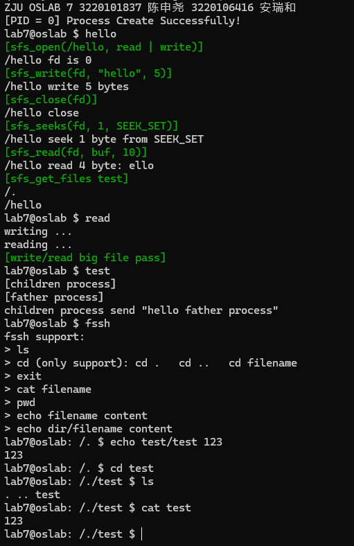

# Lab 7: RV64 文件系统 (Bonus)

## **1 **实验目的

了解文件系统系统调用的实现方法，实现基于索引节点组织方式的 Simple FS 文件系统，进一步强化对于文件系统的理解。

## **2 实验内容及要求**

- 分析代码，了解文件系统的总体架构设计，执行流程。
- 实现 Simple FS 文件系统的相关系统调用。

本 Bonus 实验为组队实验，完成后可追加分数至平时分。

本实验以验收代码为主。

**请跟随实验步骤完成实验并根据文档中的要求记录实验过程**，并命名为“**学号_姓名_lab7.pdf**"，你的代码请打包并命名为“**学号_姓名_lab7**"，文件上传至学在浙大平台。

## 3 实验步骤

### 3.1 搭建实验环境

本实验提供的代码框架结构如图，你可以点击 [lab7.zip](https://yuque.zju.edu.cn/attachments/yuque/0/2023/zip/25434/1700117091721-08617f7e-5db6-431b-822f-9c1c2db28442.zip?_lake_card=%7B%22uid%22%3A%221700117065228-0%22%2C%22src%22%3A%22https%3A%2F%2Fyuque.zju.edu.cn%2Fattachments%2Fyuque%2F0%2F2023%2Fzip%2F25434%2F1700117091721-08617f7e-5db6-431b-822f-9c1c2db28442.zip%22%2C%22name%22%3A%22lab7.zip%22%2C%22size%22%3A54462%2C%22type%22%3A%22application%2Fzip%22%2C%22ext%22%3A%22zip%22%2C%22progress%22%3A%7B%22percent%22%3A99%7D%2C%22status%22%3A%22done%22%2C%22percent%22%3A0%2C%22id%22%3A%22WxcbK%22%2C%22card%22%3A%22file%22%7D) 进行下载。首先，请下载相关代码，并移动至你所建立的本地映射文件夹中（即 `lab0` 中创建的 `os_experiment` 文件夹）。

### 3.2 Simple FS 文件系统

Simple FS（简称 SFS）文件系统是本次实验中自行设计的文件系统。一般来说，磁盘的使用是以扇区（Sector）为单位的，但为了实现简便，本实验以 4KB 大小的块（Block）为基本单位。

#### 3.2.1 文件系统布局

| 磁盘块（Block） |         0         |       1       | 2~2+freemap |          剩下所有          |
| :-------------: | :----------------: | :------------: | :---------: | :------------------------: |
|                | (superblock)超级块 | 根目录索引节点 | 空闲块映射 | inode, dir data, file data |

- 第 0 块：该位置存储文件系统的超级块，包含该文件系统的元信息及基本参数。当文件系统初次加载时，就需要读取超级块的内容进入内存做初始化检测。

```cpp
struct sfs_super {
    uint32_t magic;                  // SFS_MAGIC,
    								 // 魔数，可以通过检查该数字来判断是否是 SFS 文件系统
  
    uint32_t blocks;                 // blocks number in fs
    								 // 本文件系统总共有多少个 blocks
  
    uint32_t unused_blocks;          // unused blocks number
                                     // 有多少 blocks 还没有被使用
  
    char info[SFS_MAX_INFO_LEN + 1]; // other information
                                     // 任意信息，可自行设计
};
```

- 第 1 块：根目录索引节点，即整个文件系统根目录的 inode，从根目录开始就可以定位到该文件系统所有文件的信息。
- 第 2 ～ 2 + freemap 块：freemap 区域，用来表示该文件系统所有块的占用/空闲情况，方便分配新块，回收旧块的管理。本实验使用 1 个 bit 代表一个对应块的占用/空闲情况，例如文件系统的第 0 块是 superblock，已经被占用了，那么 freemap 区域的第 0 个 bit 就是 1。

> freemap 区域的长度是可以直接计算出来的，可以使用本文件系统总共有多少 blocks 来计算这个区域的长度

- 剩下所有：存放其他文件、目录的 inode 和实际数据。注意：虽然一个 inode 结构远小于 4KB，但为了实现简单，直接将一个 inode 存放在一个 block 中。

#### 3.2.2 磁盘索引节点 inode

以下是磁盘索引节点的相关数据结构。

```cpp
// 磁盘中的 inode 结构
struct sfs_inode {
    uint32_t size;                 // 文件大小
    uint16_t type;                 // 文件类型，文件/目录
    uint16_t links;                // 硬链接数量
    uint32_t blocks;               // 本文件占用的 block 数量
    uint32_t direct[SFS_NDIRECT];  // 直接数据块的索引值
    uint32_t indirect;             // 间接索引块的索引值
};
```

- `type` 表示一个 inode 的文件类型，在 SFS 中用来区分是文件还是目录。对于文件来说，索引值指向的数据直接就是文件数据。对于目录来说，索引值指向的数据是该目录下的目录项数组。
- `links` 表示 inode 的硬链接数量，只有当硬链接数量为 0 时，才能回收该 inode。
- `direct` 表示 inode 直接索引的数据块的编号。例如 `direct[0]` 是 9，则代表 block 9 中存储了本文件的数据。
- `indirect` 表示 inode 的间接索引块编号，该间接索引块存储了其他的直接索引块的编号。当 `indirect` 为 0 时代表不使用 `indirect` 。

> direct 和 indirect 参照课上讲的的含义理解与使用即可。

当 inode 表示一个目录的时候，其存储的数据是一个目录项数组（也就是该目录下所有文件/目录的名字以及其对应的 inode 编号的数组），目录项的数据结构如下：

```cpp
// 目录项
struct sfs_entry {
	uint32_t ino;                            // 文件的 inode 编号
    char filename[SFS_MAX_FILENAME_LEN + 1]; // 文件名
};
```

- `ino` 表示该文件对应的 inode 编号，简单起见，如果 inode 所在数据块编号为 `no` ，则 inode 编号就是 `no` ，这样可以方便寻找。
- `filename` 就是该文件的名字，其长度有上限。

> 假设我们把读取的文件内容存在了 char content[length] 数组中，则只需要做一次类型转换就可以访问所有的目录项了。例如：((sfs_entry *)content)[0]

#### 3.2.3 内存中的 inode 和 block 管理 (Buffer)

如果每次对磁盘数据的读写都需要直接和磁盘交互，那么性能明显会大打折扣。实际中往往是将磁盘数据加载进内存后，由文件系统管理这些加载进来的数据块以及 inode。这样，当需要对某个磁盘块做读写时，如果这个磁盘块已经被文件系统加载到了内存，就可以直接在内存中读写该块，之后再根据某种策略刷回磁盘即可【类似数据库中的 Buffer Pool】。例如：需要设计一个脏位来表示该块内容是否修改，在关闭文件时需要根据脏位来判断是否写回磁盘。

在本实验中，SFS 设计的管理方法如下：

```cpp
                       sfs_memory_block
                       ┌────┐   ┌────┐  ┌────┐   ┌────┐
┌───sfs_fs───┐         │    │   │    │  │    │   │    │
│            │         │    ├──►│    ├─►│    ├──►│    ├──►
│ block_list ├────────►└────┘   └────┘  └────┘   └──▲─┘
│            │                                      │
│            │                               ┌──────┘
│ hash_list  ├────────►┌────┬────┬────┬────┬─┴──┐
│            │         │ 1  │ 2  │ 3  │ 4  │ 5  │
└────────────┘         │    │    │    │    │    │
                       └────┴────┴────┴────┴────┘
```

其中，所有加载的 inode 链表头指针，根据 inode 编号查找对应 inode 块的 Hash 表均存储在 `sfs_fs` 数据结构中，该份数据仅有一份，表示整个 SFS 文件系统。

> 可以不使用 list_entry_t，而使用自己的链表数据结构

```cpp
// modified
struct sfs_fs {
    struct sfs_super super;           // SFS 的超级块
    struct bitmap *freemap;           // freemap 区域管理，可自行设计
    bool super_dirty;                 // 超级块或 freemap 区域是否有修改
    struct list_entry_t* block_list[BUFFER_SIZE];   // Hash 表 + 链表的结构 （数据结构可自行设计）
};
```

加载进来的 inode 在内存中存储为下列数据结构，其包含了磁盘原 inode 的信息，和一些关于该 inode 的元信息（编号，脏位等）。

```cpp
// modified
// 内存中的 block 缓存结构
struct sfs_memory_block {
    void* block;
    // bool is_inode;        // 是否是 inode
    uint32_t blockno;     // block 编号
    bool dirty;           // 脏位，保证写回数据
    int reclaim_count;    // 指向次数，因为硬链接有可能会打开同一个 inode，所以需要记录次数
    struct list_entry_t* inode_link; // 在 sfs_fs 内 inode_list 链表中的位置 （可根据自己的数据结构设计自行修改）
};
```

缓存管理相关的数据结构也可自行设计，但要求必须有缓存管理部分。写回策略简单起见，可以在调用文件关闭函数的时候写回相应数据。

### 3.3 功能实现

#### 3.3.1 文件系统驱动

本次实验中，为了模拟实际文件系统的读写，我们采用了 QEMU 提供的 virtio-blk-device 接口来提供基本的文件系统读写功能。【先前我们的内核程序只能修改内存内容】

具体来说，我们的改动如下：

1. 我们首先在 makefile 的 run 目标中加入了新的 `-device` 选项，这表示 QEMU 启动时，将会把 x0 作为一个 virtio-blk-device 设备加载进来，这里 x0 是我们在 `-drive` 选项中指定的 `$(SFSIMG)` 文件（即 sfs.img 文件）。这样，我们就可以通过 virtio-blk 的驱动接口来读写 `$(SFSIMG)` 文件了

```makefile
# makefile
run: vmlinux
	@qemu-system-riscv64 \
		-nographic \
		-machine virt \
		-device loader,file=vmlinux \
		-drive file=$(SFSIMG),if=none,format=raw,id=x0 \
		-device virtio-blk-device,drive=x0,bus=virtio-mmio-bus.0
```

2. 接下来，我们提供了一个 tools 文件夹，并写好了一个 `mksfs.c` 文件，该文件用于新建一个基本的 Simple File System （包含 super_block, 根目录 inode）用来做我们模拟文件系统的磁盘镜像。我们在 makefile 文件中先用 dd 指令输出了一个空的大小为 16MB 的文件，然后使用 mksfs 初始化该文件为 Simple File System 镜像。

```makefile
$(SFSIMG): tools
	dd if=/dev/zero of=$@ bs=4KB count=4096
	./tools/mksfs $@
	@echo "\033[32mMake $@ Success! \033[0m"
```

3. 之后，我们添加了 `virtio_disk.c` 文件来作为 virtio_blk_device 的读写驱动，感兴趣的同学可自行查阅其内容。
4. 为了能让驱动正常运行，我们在所有创建相关映射的部分添加了一行新的硬件映射区域，如下。

```cpp
create_mapping(pgtbl, 0x0c000000L, 0x0c000000L, 20 * 1024 * 1024, PTE_V | PTE_R | PTE_W | PTE_X);
```

5. 我们在 `fs.c` 文件中提供了基本的文件系统读写接口，如下

```cpp
// --------------------------------------------------
// ----------- read and write interface -------------

void disk_op(int blockno, uint8_t *data, bool write) {
    struct buf b;
    b.disk = 0;
    b.blockno = blockno;
    b.data = (uint8_t *)PHYSICAL_ADDR(data);
    virtio_disk_rw((struct buf *)(PHYSICAL_ADDR(&b)), write);
}

#define disk_read(blockno, data) disk_op((blockno), (data), 0)
#define disk_write(blockno, data) disk_op((blockno), (data), 1)
```

- `disk_read(blockno, data)` ：blockno 是要读的磁盘块编号，data 是一个 `uint8_t` 的数组首地址，至少要有 4096 字节大小。调用完成后，data 数组将被硬件自动填写好对应磁盘块的内容。
- `disk_write(blockno, data)` ：同上，调用完成后，硬件将会把 data 数组的 4096 字节内容写入到对应磁盘块中。
- 以下是一个使用例子。

```cpp
// 使用例子：

uint8_t * data = kmalloc(4096); // 我们的内核栈只有 4096 字节，所以千万不要开一个大数组在栈上

disk_read(1, data);

// 之后，data[0~4095] 将会是 1号 磁盘块上的内容
```

6. 【重要】virtio_blk_device 的读写操作是非阻塞的，这意味着我们调用 disk_read 或 disk_write 其实本质只是给硬件发送了一个读写信号，当硬件读写完成的时候会触发一个外部中断 (external interrupt) 来提示内核。因此，文件系统其实应该结合锁，进程 IO 阻塞态等来实现。但为了实现简单考虑，我们在 S 态发送读写信号后使用 while 循环轮询检查磁盘是否读写完。因此你可以把 disk_read 和 disk_write 看作是一个同步（阻塞）操作。也就是只有磁盘读写完才会继续向下执行。【实际情况触发 IO 操作后，会将该进程放入等待队列中，然后调度其他进程执行，本实验的实现不会调度，而是直接轮询等待 IO 完成】

#### 3.3.2 文件系统初始化 （10%）

本次试验采用懒加载模式，即只有在文件系统相关的系统调用第一次执行的时候才开始初始化文件系统，因此你需要在  `fs.c` 中的相关系统调用中，首先检查文件系统是否已经完成初始化，如果没有则调用文件系统初始化函数 `sfs_init()`  。该函数内容需要自行补充。

初始化过程中需要的全局变量等可以自行定义，请将你设计的全局变量和文件系统初始化函数 `sfs_init` 填写到下方代码框中。

```cpp
// fs.c sfs_init
```

#### 3.3.3 进程的 files_struct 结构

对于每个进程来说，每个打开的文件对应一个 file descriptor (fd), 他是一个 int 类型整数。每个进程根据 fd 来唯一的定位到其一个打开的文件。本实验中的数据结构定义如下：

```cpp
struct file {
  struct sfs_inode * inode;
  struct sfs_inode * path;
  uint64_t flags;
  uint64_t off;
  uint32_t ino;
  uint32_t path_ino;
  // 可以增加额外数据来辅助你的缓存管理
};

struct files_struct {
  struct file * fds[16];  // 一个进程最多可以同时打开 16 个文件
};

/* 进程数据结构 */
struct task_struct {
  long state;    // 进程状态 Lab3中进程初始化时置为TASK_RUNNING
  long counter;  // 运行剩余时间
  long priority; // 运行优先级 1最高 5最低
  long blocked;
  long pid; // 进程标识符
            // Above Size Cost: 40 bytes

  struct thread_struct thread; // 该进程状态段

  uint64_t sscratch; // 保存 sscratch
  uint64_t satp;     // 保存 satp

  struct mm_struct mm;
  struct files_struct fs;
};
```

一般的内核实现中，files_struct 除了包含打开的文件信息以外，还包含操作该数据结构的锁，对应文件系统的函数指针等。file 结构还包含文件的引用计数，文件的所有者等等信息。本实验中都做了简化，仅保留了一些基本信息。

这里需要注意的是 `off` 数据，其表示的是当前文件的文件指针位置（偏移量表示），例如刚开始打开文件时，off = 0，我们从这个位置写入数据其实是直接覆盖了文件开头的数据，每次写入/读取数据之后，off 都会增加对应的偏移量，这样只要不关闭文件，就可以一直读取或者写入下去。除此之外，还可以配合使用 `fseek` 等函数调整 off 位置。

#### 3.3.4 缓存结构设计（25%）

根据 [3.2.3](#2i01A) 的章节内容，我们需要设计一种文件系统的 inode 缓存结构来避免频繁的文件系统读写。你可以使用该章节提供的一种 buffer 实现思路，也可以自行编写。

请将你设计的缓存结构简单思路写在下方（验收时确认是否实现）
答：

我们使用了 1024 个桶的哈希表，每个桶里使用了无限长的链表。这样可以允许缓存无限多文件，哈希冲突也能很好地解决。

在调用 sfs_open 时会缓存文件 inode，read/write时会缓存每个访问的 block，最后文件关闭时统一释放文件的所有 block 以及 inode。

#### 3.3.5 文件系统系统调用 （65%）

本实验中需要实现的文件系统系统调用包括：

- 打开文件
- 关闭文件
- 移动文件指针
- 读取文件
- 写入文件
- 获取文件夹下所有文件

其中各功能要求如下，你需要在 `fs.c` 文件中实现这些函数。（注意我们的每个文件夹下要求有 `.` 和 `..` 这两个目录项，实现时需要注意，其含义和 Linux 中一致）

用户态下对应的系统调用已经完成， `syscall.c` 文件中根据系统调用号会调用对应函数。【但也可自行修改】

```cpp
struct sfs_fs SFS;
bool sfsInited = 0; // 保存是否初始化过

void strcpy(char *dst, const char *src) {
    for (; *src; *dst++ = *src++)
        ;
    *dst = '\0';
}
int strlen(const char *a) {
    int count;
    for (count = 0; a[count]; count++)
        ;
    return count;
}
uint32_t min(uint32_t x, uint32_t y) {
    return x < y ? x : y;
}
uint32_t hash(uint32_t x) {
    return x % BUFFER_SIZE;
}

struct list_entry_t *cacheGet(uint32_t blockno) {
    for (struct list_entry_t *node = SFS.block_list[hash(blockno)]; node != NULL; node = node->next)
        if (blockno == node->data->blockno)
            return node;
    return NULL;
}
struct list_entry_t *cacheNew(uint32_t blockno) {
    uint32_t hashID = hash(blockno);
    // 先在缓存池中查找
    struct list_entry_t *node;
    for (node = SFS.block_list[hashID]; node != NULL; node = node->next)
        if (blockno == node->data->blockno)
            break;
    // 如果找不到就创建新的节点
    if (node == NULL) {
        // 初始化新块
        node = kmalloc(sizeof(struct list_entry_t));
        node->data = kmalloc(sizeof(struct sfs_memory_block));
        node->data->block = kmalloc(BLOCK_SIZE);
        node->data->blockno = blockno;
        node->data->dirty = 0;
        node->data->reclaim_count = 0;
        node->data->inode_link = node;
        disk_read(blockno, node->data->block);
        // 插入节点到表头
        struct list_entry_t *nextnode = SFS.block_list[hashID];
        SFS.block_list[hashID] = node;
        node->prev = NULL;
        node->next = nextnode;
        if (nextnode) {
            nextnode->prev = node;
        }
    }
    return node;
}
void cacheDelete(uint32_t blockno) {
    uint32_t hashID = hash(blockno);
    // 先在缓存池中查找
    struct list_entry_t *node;
    for (node = SFS.block_list[hashID]; node != NULL; node = node->next)
        if (blockno == node->data->blockno)
            break;
    if (node == NULL)
        return;
    // 如果找到就删除节点
    struct list_entry_t *nextnode = node->next;
    struct list_entry_t *prevnode = node->prev;
    // 更新前后节点
    if (prevnode)
        prevnode->next = nextnode;
    if (nextnode)
        nextnode->prev = prevnode;
    // 更新表头
    if (node == SFS.block_list[hashID]) {
        SFS.block_list[hashID] = nextnode;
    }
    kfree(node->data->block);
    kfree(node->data);
    kfree(node);
}

// 获取一个block
void *readBlock(uint32_t blockno) {
    struct list_entry_t *node = cacheNew(blockno);
    node->data->reclaim_count += 1;
    return node->data->block;
}
// 设置dirty
void modifyBlock(uint32_t blockno) {
    struct list_entry_t *node = cacheGet(blockno);
    if (node == NULL) {
        printf("modifyBlock failed: block not found\n");
        return;
    }
    node->data->dirty = 1;
}
// 释放一个块
void releaseBlock(uint32_t blockno) {
    struct list_entry_t *node = cacheGet(blockno);
    // // 如果找不到就直接返回
    // if (node == NULL)
    //     return;
    node->data->reclaim_count--;
    // 如果没有指针引用就可以释放
    if (node->data->reclaim_count == 0) {
        printf("[releaseBlock]write back %d\n", blockno);
        if (node->data->dirty) {
            node->data->dirty = 0;
            disk_write(blockno, node->data->block);
        }
        printf("[releaseBlock]release %d\n", blockno);
        cacheDelete(blockno);
    }
}
// 尝试写回某个块
void writeBlock(uint32_t blockno) {
    printf("[writeBlock]write back %d\n", blockno);
    struct list_entry_t *node = cacheGet(blockno);
    // 如果找不到就直接返回
    if (node == NULL)
        return;
    // 脏块写回
    if (node->data->dirty) {
        node->data->dirty = 0;
        disk_write(blockno, node->data->block);
    }
}
// 找到一个新的空Block的编号
uint32_t NewBlock() { // 暂时不考虑磁盘空间不够的情况
    SFS.super.unused_blocks--;
    SFS.super_dirty = 1;
    int i = 0, j = 0;
    for (; i <= BLOCK_SIZE && SFS.freemap->freemap[i] == 0xFF; i++)
        ; // 找到第一个可能空的块
    for (; (SFS.freemap->freemap[i] >> j) & 1; j++)
        ;                              // 找到空块里的第一个空点
    SFS.freemap->freemap[i] |= 1 << j; // 初始化
    return (i << 3) + j;
}
// 将一个inode的所有数据块写回
void writeInode(uint32_t blockno, bool Type) {
    struct sfs_inode *node = cacheGet(blockno);
    // // 如果找不到就直接返回
    // if (node == NULL)
    //     return;
    printf("[writeInode]no: %d, size: %d\n", blockno, node->size);
    int numBlock = (node->size + BLOCK_SIZE - 1) / BLOCK_SIZE;
    // 直接索引
    for (int i = 0; i < SFS_NDIRECT && i < numBlock; i++) {
        writeBlock(node->direct[i]);
        // releaseBlock(node->direct[i]);
    }
    // 间接索引
    if (numBlock > SFS_NDIRECT) {
        uint32_t *indirect = readBlock(node->indirect);
        for (int i = SFS_NDIRECT; i < numBlock; i++) {
            writeBlock(indirect[i - SFS_NDIRECT]);
            // releaseBlock(indirect[i - SFS_NDIRECT]);
        }
        writeBlock(node->indirect);
        // releaseBlock(node->indirect);
    }
}

// looks like there is a bug in the memory system
void memory_bug() {
    struct list_entry_t *node;
    for (int count = 0; count < 1 << 12; count++) {
        node = kmalloc(sizeof(struct list_entry_t));
        node->data = kmalloc(sizeof(struct sfs_memory_block));
        node->data->block = kmalloc(BLOCK_SIZE);
        kfree(node->data->block);
        kfree(node->data);
        kfree(node);
    }
}

// -------------------------------------------------

int sfs_init() {                // 应该直接读取块中的内容比较好
    disk_read(0, (&SFS.super)); // 读取内容
    SFS.freemap = (struct bitmap *)kmalloc(sizeof(struct bitmap));
    if (SFS.freemap == NULL)
        return -1;
    disk_read(2, SFS.freemap->freemap); // 读取freemap
    SFS.super_dirty = 0;                // 刚开始并没有修改过超级块或者freemap
    memset(SFS.block_list, NULL, sizeof(SFS.block_list));
    sfsInited = 1;
    printf("[sfs_init]init success!\n");
    return 0;
}

/**
 * 功能: 打开一个文件, 读权限下如果找不到文件，则返回一个小于 0
 * 的值，表示出错，写权限如果没有找到文件，则创建该文件（包括缺失路径）
 * @path : 文件路径 (绝对路径)
 * @flags: 读写权限 (read, write, read | write)
 * @ret  : file descriptor (fd), 每个进程根据 fd 来唯一的定位到其一个打开的文件
 *         正常返回一个大于 0 的 fd 值, 其他情况表示出错
 */
int sfs_open(const char *path, uint32_t flags) {
    // 检查是否初始化
    if (!sfsInited && sfs_init())
        return -1;
    printf("[sfs_open]path: %s\n", path);
    // 路径必须从根目录开始
    if (path[0] != '/')
        return -1;

    struct sfs_inode *node = readBlock(1), *preNode = NULL,
                     *nextNode = NULL; // PreNode存储上一个节点
    int nameStart = 1, name_end = 1;
    uint32_t ino = 1, preino = 1, nextino = 1;
    while (path[name_end]) {
        if (path[nameStart] == '/')
            return -1; // /连用，无法识别
        else if (path[nameStart] == 0)
            break; // 合法情况，如/home/
        // 如果上层目录是文件
        if (node->type == SFS_FILE)
            return -1;
        // 找到下一个'/'的位置
        for (name_end += 1; path[name_end] && path[name_end] != '/'; name_end++)
            ;
        printf("[sfs_open]ino: %d, str index: %d %d\n", ino, nameStart, name_end);
        bool ifok = 0;
        int entryNum = node->size / sizeof(struct sfs_entry); // entry的总数量
        // 直接索引
        for (int i = 0; i < node->blocks && i < SFS_NDIRECT; i++) {
            struct sfs_entry *entry = readBlock(node->direct[i]);
            // printf("node->direct[i]: %d\n", node->direct[i]);
            for (int j = 0; j < NUM_ENTRY && i * NUM_ENTRY + j < entryNum; j++) {
                // /   a  b c d e f g h   /
                //  index             next_slash
                if ((name_end - nameStart) != strlen(entry[j].filename))
                    continue;
                int k;
                for (k = 0; k < name_end - nameStart - 1; k++)
                    if (!entry[j].filename[k] || entry[j].filename[k] != path[nameStart + k])
                        break;
                if (entry[j].filename[k] == path[nameStart + k]) { // 找到了同名目录
                    nextino = entry[j].ino;
                    nextNode = (struct sfs_inode *)readBlock(entry[j].ino);
                    ifok = 1;
                    break;
                }
            }
            releaseBlock(node->direct[i]);
            if (ifok) // 如果已经找到就结束
                break;
        }
        printf("[sfs_open]%s\n", ifok == 0 ? "not find" : "find");
        // 找不到路径，尝试创建
        if (!ifok) {
            // 权限不够
            if (flags & SFS_FLAG_WRITE == 0)
                return -1;
            // 初始化新块
            nextino = NewBlock();
            nextNode = (struct sfs_inode *)readBlock(nextino);
            {
                // 目录要有两个entry，文件没有大小
                nextNode->size = path[name_end] ? sizeof(struct sfs_entry) << 1 : 0;
                // type需要看是不是路径的末尾
                nextNode->type = path[name_end] ? SFS_DIRECTORY : SFS_FILE;
                nextNode->links = 1;
                nextNode->blocks = 1;
                nextNode->direct[0] = NewBlock(); // 申请一个新的块
                nextNode->indirect = 0;
            }
            modifyBlock(nextino); // 设置成脏块
            printf("[sfs_open]nextino:%d, direct no:%d\n", nextino, nextNode->direct[0]);
            // 为文件夹添加两个默认相对路径
            if (nextNode->type == SFS_DIRECTORY) {
                struct sfs_entry *entry = (struct sfs_entry *)readBlock(nextNode->direct[0]);
                {
                    entry[0].ino = nextino;
                    strcpy(entry[0].filename, ".");
                    entry[1].ino = ino;
                    strcpy(entry[1].filename, "..");
                }
                modifyBlock(nextNode->direct[0]); // 设置成脏块
                releaseBlock(nextNode->direct[0]);
            }
            // 将这块给它接到父亲节点上
            struct sfs_entry newentry;
            for (int i = 0; i < name_end - nameStart; i++)
                newentry.filename[i] = path[nameStart + i];
            newentry.filename[name_end - nameStart] = 0;
            newentry.ino = nextino;
            if (node->size != node->blocks * sizeof(struct sfs_entry) * NUM_ENTRY) {     // 即最后一块不是满的
                struct sfs_entry *LastBlock = readBlock(node->direct[node->blocks - 1]); // 取出最后一块
                {
                    LastBlock[entryNum % NUM_ENTRY] = newentry;
                }
                modifyBlock(node->direct[node->blocks - 1]);
                releaseBlock(node->direct[node->blocks - 1]);
                // 不考虑间接索引
            } else { // 最后一块是满的，那就申请一个新块
                node->direct[node->blocks] = NewBlock();
                disk_write(node->direct[node->blocks], &newentry); // 写回新块，不用读到BufferPool里
                node->blocks++;
                // 不考虑间接索引
            }
            node->size += sizeof(struct sfs_entry); // 多了一个节点
            modifyBlock(ino);
        }

        // 释放掉老的PreNode
        if (preino != ino)
            releaseBlock(preino);
        preNode = node;
        preino = ino;
        node = nextNode;
        ino = nextino;
        nameStart = name_end + 1;
        printf("[sfs_open]ino: %d preino: %d\n", ino, preino);
    }
    writeBlock(preino);
    // 有同名目录
    if (node->type == SFS_DIRECTORY)
        return -1;
    // 创建文件，找一个空的指针填入
    for (int i = 0; i < 16; i++)
        if (current->fs.fds[i] == NULL) {
            current->fs.fds[i] = kmalloc(sizeof(struct file));
            current->fs.fds[i]->flags = flags;
            current->fs.fds[i]->inode = node;
            current->fs.fds[i]->off = 0;
            current->fs.fds[i]->path = preNode;
            current->fs.fds[i]->ino = ino;
            current->fs.fds[i]->path_ino = preino;
            printf("[sfs_open]success open a new file\n");
            return i;
        }
    return -1; // 打开了太多的文件
}

/**
 * 功能: 关闭一个文件，并将其修改过的内容写回磁盘
 * @fd  : 该进程打开的文件的 file descriptor (fd)
 * @ret : 正确关闭返回 0, 其他情况表示出错
 */
int sfs_close(int fd) {
    // 检查是否初始化
    if (!sfsInited && sfs_init())
        return -1;
    struct file *f = current->fs.fds[fd];
    // 检查文件是否打开
    if (!f) {
        printf("[sfs_close]file not opened\n");
        return -1;
    }
    // 将文件写回
    printf("[sfs_close]WriteBack file\n");
    writeInode(f->ino, SFS_FILE);

    // // 将路径上所有访问过的点及其数据块写回
    // printf("[sfs_close]WriteBack dirs\n");
    // uint32_t ino = f->path_ino;
    // while (ino > 1) {
    //     struct sfs_inode *node = (struct sfs_inode *)readBlock(ino);
    //     printf("[sfs_close]write ino %d\n", ino);
    //     writeInode(ino, SFS_DIRECTORY);
    //     struct sfs_entry *entrys = readBlock(node->direct[0]);
    //     uint32_t tmp = entrys[1].ino; // ..目录
    //     releaseBlock(node->direct[0]);
    //     releaseBlock(ino);
    //     ino = tmp;
    // }
    // printf("[sfs_close]write ino %d\n", ino);
    // writeInode(ino, SFS_DIRECTORY);

    // 写回bitmap和super块
    if (SFS.super_dirty) {
        disk_write(0, &SFS.super);
        disk_write(2, SFS.freemap->freemap);
        SFS.super_dirty = 0;
    }

    // 释放空间
    releaseBlock(f->ino);
    releaseBlock(f->path_ino);
    kfree(f);
    current->fs.fds[fd] = NULL;
    return 0;
}

/**
 * 功能  : 根据 fromwhere + off 偏移量来移动文件指针(可参考 C 语言的 fseek 函数功能)
 * @fd  : 该进程打开的文件的 file descriptor (fd)
 * @off : 偏移量
 * @fromwhere : SEEK_SET(文件头), SEEK_CUR(当前), SEEK_END(文件尾)
 * @ret : 表示错误码
 *        = 0 正确返回
 *        < 0 出错
 */
int sfs_seek(int fd, int32_t off, int fromwhere) {
    // 检查是否初始化
    if (!sfsInited && sfs_init())
        return -1;
    printf("[sfs_seek]fd = %d, off = %d, fromwhere = %d\n", fd, off, fromwhere);
    struct file *f = current->fs.fds[fd];
    // 检查文件是否打开
    if (!f) {
        printf("[sfs_seek]file not opened\n");
        return -1;
    }
    int32_t newOff;
    switch (fromwhere) {
    case SEEK_SET:
        newOff = off;
        break;
    case SEEK_END:
        newOff = f->inode->size - off;
        break;
    default:
        newOff = f->off + off;
        break;
    }
    // 越界
    if (newOff < 0 || newOff >= f->inode->size)
        return -1;
    f->off = newOff;
    return 0;
}

/**
 * 功能  : 从文件的文件指针开始读取 len 个字节到 buf 数组中 (结合 sfs_seek 函数使用)，并移动对应的文件指针
 * @fd  : 该进程打开的文件的 file descriptor (fd)
 * @buf : 读取内容的缓存区
 * @len : 要读取的字节的数量
 * @ret : 返回实际读取的字节的个数
 *        < 0 表示出错
 *        = 0 表示已经到了文件末尾，没有能读取的了
 *        > 0 表示实际读取的字节的个数，比如 len = 8，但是文件只剩 5 个字节的情况，就是返回 5
 */
int sfs_read(int fd, char *buf, uint32_t len) {
    // 检查是否初始化
    if (!sfsInited && sfs_init())
        return -1;
    struct file *f = current->fs.fds[fd];
    // 检查文件是否打开
    if (!f) {
        printf("[sfs_read]file not opened\n");
        return -1;
    }
    // printf("[sfs_read]remain: %d\n", f->inode->size - f->off);
    // 防止越界
    len = min(len, f->inode->size - f->off);
    if (len == 0)
        return 0;
    int blockindex = f->off / BLOCK_SIZE;
    int off = f->off % BLOCK_SIZE;
    uint32_t bufoff = 0;
    struct sfs_inode *node = f->inode;
    // 直接索引
    while (blockindex < SFS_NDIRECT && len) {
        uint32_t blocklen = min(len, BLOCK_SIZE - off);
        char *block = readBlock(node->direct[blockindex]);
        memcpy(buf + bufoff, block + off, blocklen);
        releaseBlock(node->direct[blockindex]);
        bufoff += blocklen;
        len -= blocklen;
        blockindex++;
        off = 0;
    }
    // 间接索引
    if (len) {
        blockindex -= SFS_NDIRECT;
        uint32_t *indirect = readBlock(node->indirect);
        while (len) {
            uint32_t blocklen = min(len, BLOCK_SIZE - off);
            char *block = readBlock(indirect[blockindex]);
            memcpy(buf + bufoff, block + off, blocklen);
            releaseBlock(indirect[blockindex]);
            bufoff += blocklen;
            len -= blocklen;
            blockindex++;
            off = 0;
        }
        releaseBlock(node->indirect);
    }
    f->off += bufoff;
    return bufoff;
}

/**
 * 功能  : 把 buf 数组的前 len 个字节写入到文件的文件指针位置(覆盖)(结合 sfs_seek 函数使用)，并移动对应的文件指针
 * @fd  : 该进程打开的文件的 file descriptor (fd)
 * @buf : 写入内容的缓存区
 * @len : 要写入的字节的数量
 * @ret : 返回实际的字节的个数
 *        < 0 表示出错
 *        >=0 表示实际写入的字节数量
 */
int sfs_write(int fd, char *buf, uint32_t len) {
    // 检查是否初始化
    if (!sfsInited && sfs_init())
        return -1;
    struct file *f = current->fs.fds[fd];
    // 检查文件是否打开
    if (!f) {
        printf("[sfs_write]file not opened\n");
        return -1;
    }
    if (f->flags & SFS_FLAG_WRITE == 0) {
        return -1; // 权限错误
    }
    int blockindex = f->off / BLOCK_SIZE;
    int off = f->off % BLOCK_SIZE;
    // printf("blockindex: %d off: %d\n", blockindex, off);
    uint32_t bufoff = 0;
    // 更新size
    if (len > f->inode->size - f->off) { // 超出了大小
        f->inode->size = f->off + len;   // 更新size
        modifyBlock(f->ino);
    }
    struct sfs_inode *node = f->inode;
    // 先搜索直接索引
    while (blockindex < SFS_NDIRECT && len) {
        if (blockindex >= node->blocks) { // 块超出范围
            node->direct[blockindex] = NewBlock();
            node->blocks++;
            modifyBlock(f->ino);
        }
        uint32_t blocklen = min(len, BLOCK_SIZE - off);
        char *block = readBlock(node->direct[blockindex]);
        memcpy(block + off, buf + bufoff, blocklen);
        modifyBlock(node->direct[blockindex]);
        // releaseBlock(node->direct[blockindex]);
        bufoff += blocklen;
        len -= blocklen;
        blockindex++;
        off = 0;
    }
    // 接下来间接索引,不考虑文件过大连间接索引都无法承载的情况
    if (len) {
        blockindex -= SFS_NDIRECT;
        if (node->indirect == 0) { // 如果没有indirect的节点还需要先申请
            node->indirect = NewBlock();
        }
        uint32_t *indirect = readBlock(node->indirect);
        while (len) {
            uint32_t blocklen = min(len, BLOCK_SIZE - off);
            if (blockindex + SFS_NDIRECT >= node->blocks) {
                indirect[blockindex] = NewBlock();
                node->blocks++;
                modifyBlock(node->indirect);
            }
            char *block = readBlock(indirect[blockindex]);
            memcpy(block + off, buf + bufoff, blocklen);
            modifyBlock(indirect[blockindex]);
            // releaseBlock(indirect[blockindex]);
            bufoff += blocklen;
            len -= blocklen;
            blockindex++;
            off = 0;
        }
        // releaseBlock(node->indirect);
    }
    f->off += bufoff;
    return bufoff;
}

/**
 * 功能    : 获取 path 下的所有文件名，并存储在 files 数组中
 * @path  : 文件夹路径 (绝对路径)
 * @files : 保存该文件夹下所有的文件名
 * @ret   : > 0 表示该文件夹下有多少文件
 *          = 0 表示该 path 是一个文件
 *          < 0 表示出错
 */
int sfs_get_files(const char *path, char *files[]) {
    // 检查是否初始化
    if (!sfsInited && sfs_init())
        return -1;
    printf("sfs_get_files path: %s\n", path);
    // 路径必须从根目录开始
    if (path[0] != '/')
        return -1;

    struct sfs_inode *node = readBlock(1), *preNode = NULL,
                     *nextNode = NULL; // PreNode存储上一个节点
    int nameStart = 1, name_end = 1;
    uint32_t ino = 1, preino = 1, nextino = 1;
    while (path[name_end]) {
        if (path[nameStart] == '/') {
            printf("[sfs_get_files]break");
            return -1; // /连用，无法识别
        } else if (path[nameStart] == 0)
            break; // 合法情况，如/home/
        // 如果上层目录是文件
        if (node->type == SFS_FILE)
            return -1;
        // 找到下一个'/'的位置
        for (name_end += 1; path[name_end] && path[name_end] != '/'; name_end++)
            ;
        printf("[sfs_get_files]ino: %d, str index: %d %d\n", ino, name_end, nameStart);
        bool ifok = 0;
        int entryNum = node->size / sizeof(struct sfs_entry); // entry的总数量
        // 直接索引
        for (int i = 0; i < node->blocks && i < SFS_NDIRECT; i++) {
            struct sfs_entry *entry = readBlock(node->direct[i]);
            // printf("node->direct[i]: %d\n", node->direct[i]);
            for (int j = 0; j < NUM_ENTRY && i * NUM_ENTRY + j < entryNum; j++) {
                // /   a  b c d e f g h   /
                //  index             next_slash
                if ((name_end - nameStart) != strlen(entry[j].filename))
                    continue;
                int k;
                for (k = 0; k < name_end - nameStart - 1; k++)
                    if (!entry[j].filename[k] || entry[j].filename[k] != path[nameStart + k])
                        break;
                if (entry[j].filename[k] == path[nameStart + k]) { // 找到了同名目录
                    nextino = entry[j].ino;
                    nextNode = (struct sfs_inode *)readBlock(entry[j].ino);
                    ifok = 1;
                    break;
                }
            }
            releaseBlock(node->direct[i]);
            if (ifok) // 如果已经找到就结束
                break;
        }
        printf("[sfs_get_files]%s\n", ifok == 0 ? "not find" : "find");
        // 找不到路径
        if (!ifok) {
            return -1;
        }

        // 释放掉老的PreNode
        if (preino != ino)
            releaseBlock(preino);
        preNode = node;
        preino = ino;
        node = nextNode;
        ino = nextino;
        nameStart = name_end + 1;
        printf("[sfs_get_files]ino: %d preino: %d\n", ino, preino);
    }

    if (node->type == SFS_FILE)
        return 0; // 当前目录是一个文件

    uint32_t count = 0;
    int numBlock = (node->size + BLOCK_SIZE - 1) / BLOCK_SIZE;
    printf("[sfs_get_files]numBlock: %d\n", numBlock);
    // 直接索引
    for (int i = 0; i < SFS_NDIRECT && i < numBlock; i++) {
        printf("[sfs_get_files]direct[%d]: %d\n", i, node->direct[i]);
        struct sfs_entry *entrys = readBlock(node->direct[i]);
        for (int j = 0; j < NUM_ENTRY && i * BLOCK_SIZE + j * sizeof(struct sfs_entry) < node->size; j++) {
            printf("[sfs_get_files]direct[%d][%d]: %s\n", i, j, entrys[j].filename);
            strcpy(files[count++], entrys[j].filename);
        }
        releaseBlock(node->direct[i]);
    }
    // 间接索引
    if (numBlock > SFS_NDIRECT) {
        uint32_t *indirect = readBlock(node->indirect);
        for (int i = SFS_NDIRECT; i < numBlock; i++) {
            struct sfs_entry *entrys = readBlock(indirect[i - SFS_NDIRECT]);
            for (int j = 0; j < NUM_ENTRY && i * BLOCK_SIZE + j * sizeof(struct sfs_entry) < node->size; j++)
                strcpy(files[count++], entrys[j].filename);
            releaseBlock(indirect[i - SFS_NDIRECT]);
        }
        releaseBlock(node->indirect);
    }
    return count;
}
```

### 3.4 编译和测试

仿照 Lab 6 进行编译及调试，对 `main.c` 做修改，确保输出你的学号与姓名。在项目最外层输入 `make run` 命令调用 Makefile 文件完成整个工程的编译及执行。

这次，我们的终端提供了 4 个基本的测试程序，你可以像 Lab 6 一样依次执行他们。

1. hello: 包含所有文件系统调用各一次，用来检查基本的实现
2. read: 会先进行大文件的写，再进行大文件的读来检查（可以自己修改文件大小来测试你的逻辑是否正确）
3. test: 各种调用的综合测试
4. fssh: 实现了 cd 和 ls 和 cat 和 echo 和 pwd 和 exit 的简单 shell。

另外，最好安装 VSCode 上的 Hex Editor 插件，以 16 进制打开 sfs.img 文件来检查写入的字节是否正确。【通过其他软件检查也可】

请在此附上你的所有测试程序实验结果截图。


